# Bootstrap 5 Containers

<details>
  <summary>click to expand</summary>

## Bootstrap 5 Containers

- Containers are used to pad the content inside of them, and there are two container classes available:

1. The `.container` class provides a responsive fixed width container.
2. The `.container-fluid` class provides a full width container, spanning the entire width of the viewport.

    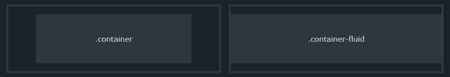

## Fixed Container

- Use the `.container` class to create a responsive, fixed-width container.

- Note that its width (max-width) will change on different screen sizes:

    ||Extra small< 576px|Small ≥ 576px|Medium ≥ 768px|Large ≥ 992px|Extra Large ≥ 1200px|XXL ≥ 1400px|
    |:---:|:---:|:---:|:---:|:---:|:---:|:---:|
    |max-width|100%|540px|720px|960px|1140px|1320px|

    ```html
    <div class="container">
        <h1>My First Bootstrap Page</h1>
        <p>This is some text.</p>
    </div>
    ```

    [Try It Yourself](https://www.w3schools.com/bootstrap5/tryit.asp?filename=trybs_gs_container&stacked=h)

## Fluid Container

- Use the `.container-fluid` class to create a full width container, that will always span the entire width of the screen (width is always 100%):

    ```html
    <div class="container-fluid">
        <h1>My First Bootstrap Page</h1>
        <p>This is some text.</p>
    </div>
    ```

    [Try It Yourself](https://www.w3schools.com/bootstrap5/tryit.asp?filename=trybs_gs_container-fluid&stacked=h)

## Container Padding

`p` | `px-[0-5]` | `px-[0-5]` | `pt-[0-5]` | `pb-[0-5]` | `ps-[0-5]` | `pe-[0-5]`

- Add a top padding

    ```html
    <div class="container pt-1"></div>
    <div class="container pt-2"></div>
    <div class="container pt-3"></div>
    <div class="container pt-4"></div>
    <div class="container pt-5"></div>
    ```

    [Try It Yourself](https://www.w3schools.com/bootstrap5/tryit.asp?filename=trybs_container_padding&stacked=h)

- Add a bottom padding

    ```html
    <div class="container pb-1"></div>
    ...
    ```

- Add a left padding

    ```html
    <div class="container ps-2"></div>
    ...
    ```

- Add a right padding

    ```html
    <div class="container pe-3"></div>
    ...
    ```

- Add 4 direct padding

    ```html
    <div class="container p-4"></div>
    ...
    ```

- Add horizontal padding (left-right)

    ```html
    <div class="container px-4"></div>
    ...
    ```

- Add vertical padding (up-down)

    ```html
    <div class="container py-4"></div>
    ...
    ```

## Container Margin

`m` | `mx-[0-5]` | `mx-[0-5]` | `mt-[0-5]` | `mb-[0-5]` | `ms-[0-5]` | `me-[0-5]`

- Add margin

    ```html
    <div class="container mt-5"></div> <!-- Add a top margin -->
    <div class="container mb-1"></div> <!-- Add a bottom margin -->
    <div class="container ms-2"></div> <!-- Add a left margin -->
    <div class="container me-3"></div> <!-- Add a right margin -->
    <div class="container m-4"></div> <!-- Add 4 direct margin -->
    <div class="container mx-4"></div> <!-- Add horizontal margin (left-right) -->
    <div class="container my-4"></div> <!-- Add vertical margin (up-down) -->
    ...
    ```

## Container Border and Color

- Other utilities, such as borders and colors, are also often used together with containers:

    ```html
    <div class="container p-5 my-5 border"></div>

    <div class="container p-5 my-5 bg-dark text-white"></div>

    <div class="container p-5 my-5 bg-primary text-white"></div>
    ```

    [Try It Yourself](https://www.w3schools.com/bootstrap5/tryit.asp?filename=trybs_container_color&stacked=h)

## Responsive Containers

- You can also use the `.container-sm|md|lg|xl|xxl` classes to determine when the container should be responsive.

- The `max-width` of the container will change on different screen sizes/viewports:

    |Class|Extra small < 576px|Small ≥ 576px|Medium ≥ 768px|Large ≥ 992px|Extra large ≥ 1200px|XXL ≥ 1400px|
    |:---:|:---:|:---:|:---:|:---:|:---:|:---:|
    |`.container-sm`|100%|540px|720px|960px|1140px|1320px|
    |`.container-md`|100%|100%|720px|960px|1140px|1320px|
    |`.container-lg`|100%|100%|100%|960px|1140px|1320px|
    |`.container-xl`|100%|100%|100%|100%|1140px|1320px|
    |`.container-xxl`|100%|100%|100%|100%|100%|1320px|

    ```html
    <div class="container-sm">.container-sm</div>
    <div class="container-md">.container-md</div>
    <div class="container-lg">.container-lg</div>
    <div class="container-xl">.container-xl</div>
    <div class="container-xxl">.container-xxl</div>
    ```

    [Try It Yourself](https://www.w3schools.com/bootstrap5/tryit.asp?filename=trybs_container_resp&stacked=h)

# Bootstrap 5 Grids

## Bootstrap 5 Grid System

- Bootstrap's grid system is built with flexbox and allows up to 12 columns across the page.

- If you do not want to use all 12 columns individually, you can group the columns together to create wider columns:

- The grid system is responsive, and the columns will re-arrange automatically depending on the screen size.

- Make sure that the sum adds up to 12 or fewer (it is not required that you use all 12 available columns).

    

## Grid Classes

- The Bootstrap 5 grid system has six classes:

  - `.col-` (extra small devices - screen width less than 576px)
  - `.col-sm-` (small devices - screen width equal to or greater than 576px)
  - `.col-md-` (medium devices - screen width equal to or greater than 768px)
  - `.col-lg-` (large devices - screen width equal to or greater than 992px)
  - `.col-xl-` (xlarge devices - screen width equal to or greater than 1200px)
  - `.col-xxl-` (xxlarge devices - screen width equal to or greater than 1400px)

**Tip**: Each class scales up, so if you want to set the same widths for `sm` and `md`, you only need to specify `sm`.

## Basic Structure of a Bootstrap 5 Grid

- The following is a basic structure of a Bootstrap 5 grid:

    ```html
    <!-- Control the column width, and how they should appear on different devices -->
    <div class="row">
        <div class="col-*-*"></div>
        <div class="col-*-*"></div>
    </div>
    <div class="row">
        <div class="col-*-*"></div>
        <div class="col-*-*"></div>
        <div class="col-*-*"></div>
    </div>
    <!-- Or let Bootstrap automatically handle the layout -->
    <div class="row">
        <div class="col"></div>
        <div class="col"></div>
        <div class="col"></div>
    </div>
    ```

### Three Equal Columns

- The following example shows how to create three equal-width columns, on all devices and screen widths:

    ```html
    <div class="row">
        <div class="col">.col</div>
        <div class="col">.col</div>
        <div class="col">.col</div>
    </div>
    ```

    [Try It Yourself](https://www.w3schools.com/bootstrap5/tryit.asp?filename=trybs_grid_ex&stacked=h)

### Responsive Columns

- The following example shows how to create four equal-width columns starting at tablets and scaling to extra large desktops. **On mobile phones or screens that are less than 576px wide, the columns will automatically stack on top of each other**:

    ```html
    <div class="row">
        <div class="col-sm-3">.col-sm-3</div>
        <div class="col-sm-3">.col-sm-3</div>
        <div class="col-sm-3">.col-sm-3</div>
        <div class="col-sm-3">.col-sm-3</div>
    </div>
    ```

    [Try It Yourself](https://www.w3schools.com/bootstrap5/tryit.asp?filename=trybs_grid_ex1&stacked=h)

### Two Unequal Responsive Columns

- The following example shows how to get two various-width columns starting at tablets and scaling to large extra desktops:

    ```html
    <div class="row">
        <div class="col-sm-4">.col-sm-4</div>
        <div class="col-sm-8">.col-sm-8</div>
    </div>
    ```

    [Try It Yourself](<https://www.w3schools.com/bootstrap5/tryit.asp?filename=trybs_grid_ex2&stacked=h>)

</details>

# Bootstrap 5 Text/Typography

<details>
  <summary>click to expand</summary>

## Bootstrap 5 Default Settings

- Bootstrap 5 uses a default `font-size` of `1rem` (`16px` by default), and its `line-height` is `1.5`.

- In addition, all `<p>` elements have `margin-top: 0` and `margin-bottom: 1rem` (`16px` by default).

## `<h1>` - `<h6>`

- Bootstrap 5 styles HTML headings (`<h1>` to `<h6>`)  with a bolder `font-weight` and a responsive `font-size`.

- You can also use .h1 to .h6 classes on other elements to make them behave as headings if you want:

    ```html
    <p class="h1">h1 Bootstrap heading</p>
    <p class="h2">h2 Bootstrap heading</p>
    <p class="h3">h3 Bootstrap heading</p>
    <p class="h4">h4 Bootstrap heading</p>
    <p class="h5">h5 Bootstrap heading</p>
    <p class="h6">h6 Bootstrap heading</p>
    ```

    [Try It Yourself](https://www.w3schools.com/bootstrap5/tryit.asp?filename=trybs_txt_hn2&stacked=h)

## Display Headings

- Display headings are used to stand out more than normal headings (larger `font-size` and lighter `font-weight`), and there are six classes to choose from: `.display-1` to `.display-6`:

    [Try It Yourself](https://www.w3schools.com/bootstrap5/tryit.asp?filename=trybs_txt_display&stacked=h)

## `<small>`

- In Bootstrap 5 the HTML `<small>` element (and the `.small` class) is used to create a smaller, secondary text in any heading:

    [Try It Yourself](https://www.w3schools.com/bootstrap5/tryit.asp?filename=trybs_txt_small&stacked=h)

## `<mark>`

- Bootstrap 5 will style `<mark>` and `.mark` with a yellow background color and some padding:

    [Try It Yourself](https://www.w3schools.com/bootstrap5/tryit.asp?filename=trybs_txt_mark&stacked=h)

## `<abbr>`

- Bootstrap 5 will style the HTML `<abbr>` element with a dotted border bottom and a cursor with question mark on hover:

    [Try It Yourself](https://www.w3schools.com/bootstrap5/tryit.asp?filename=trybs_txt_abbr&stacked=h)

## `<blockquote>`

- Add the `.blockquote` class to a `<blockquote>` when quoting blocks of content from another source. And when naming a source, like "from WWF's website", use the `.blockquote-footer` class:

    [Try It Yourself](https://www.w3schools.com/bootstrap5/tryit.asp?filename=trybs_txt_blockquote&stacked=h)

## `<dl>`

- Bootstrap 5 will style the HTML `<dl>` element in the following way:

    [Try It Yourself](https://www.w3schools.com/bootstrap5/tryit.asp?filename=trybs_txt_dl&stacked=h)

## `<code>`

- Bootstrap 5 will style the HTML `<code>` element in the following way:

    [Try It Yourself](https://www.w3schools.com/bootstrap5/tryit.asp?filename=trybs_txt_code&stacked=h)

## `<kbd>`

- Bootstrap 5 will style the HTML `<kbd>` element in the following way:

    [Try It Yourself](https://www.w3schools.com/bootstrap5/tryit.asp?filename=trybs_txt_kbd&stacked=h)

## `<pre>`

- Bootstrap 5 will style the HTML `<pre>` element in the following way:

    [Try It Yourself](https://www.w3schools.com/bootstrap5/tryit.asp?filename=trybs_txt_pre&stacked=h)

## More Typography Classes

- The Bootstrap 5 classes below can be added to style HTML elements further:

|Class|Description|Example|
|---|---|:---:|
|`.lead`|Makes a paragraph stand out|[Try It](https://www.w3schools.com/bootstrap5/tryit.asp?filename=trybs_ref_txt_lead&amp;stacked=h)|
|`.text-start`|Indicates left-aligned text|[Try It](https://www.w3schools.com/bootstrap5/tryit.asp?filename=trybs_ref_text-left&amp;stacked=h)|
|`.text-break`|Prevents long text from breaking layout|[Try It](https://www.w3schools.com/bootstrap5/tryit.asp?filename=trybs_ref_text-break)|
|`.text-center`|Indicates center-aligned text|[Try It](https://www.w3schools.com/bootstrap5/tryit.asp?filename=trybs_ref_text-left&amp;stacked=h)|
|`.text-decoration`|none Removes the underline from a link|[Try It](https://www.w3schools.com/bootstrap5/tryit.asp?filename=trybs_ref_txt_decoration&amp;stacked=h)|
|`.text-end`|Indicates right-aligned text|[Try It](https://www.w3schools.com/bootstrap5/tryit.asp?filename=trybs_ref_text-left&amp;stacked=h)|
|`.text-nowrap`|Indicates no wrap text|[Try It](https://www.w3schools.com/bootstrap5/tryit.asp?filename=trybs_ref_text-left&amp;stacked=h)|
|`.text-lowercase`|Indicates lowercased text|[Try It](https://www.w3schools.com/bootstrap5/tryit.asp?filename=trybs_ref_text-lowercase&amp;stacked=h)|
|`.text-uppercase`|Indicates uppercased text|[Try It](https://www.w3schools.com/bootstrap5/tryit.asp?filename=trybs_ref_text-lowercase&amp;stacked=h)|
|`.text-capitalize`|Indicates capitalized text|[Try It](https://www.w3schools.com/bootstrap5/tryit.asp?filename=trybs_ref_text-lowercase&amp;stacked=h)|
|`.initialism`|Displays the text inside an `<abbr>` element in a slightly smaller font size|[Try It](https://www.w3schools.com/bootstrap5/tryit.asp?filename=trybs_ref_txt_abbr2&amp;stacked=h)|
|`.list-unstyled`|Removes the default list-style and left margin on list items (works on both `<ul>` and `<ol>`). This class only applies to immediate children list items (to remove the default list-style from any nested lists, apply this class to any nested lists as well)|[Try It](https://www.w3schools.com/bootstrap5/tryit.asp?filename=trybs_ref_txt_list-unstyled&amp;stacked=h)|
|`.list-inline`|Places all list items on a single line (used together with .list-inline-item on each `<li>` elements)|[Try It](https://www.w3schools.com/bootstrap5/tryit.asp?filename=trybs_ref_txt_list-inline&amp;stacked=h)|

## Text Colors

- Bootstrap 5 has some contextual classes that can be used to provide "meaning through colors".

- The classes for text colors are: `.text-muted`, `.text-primary`, `.text-success`, `.text-info`, `.text-warning`, `.text-danger`, `.text-secondary`, `.text-white`, `.text-dark`, `.text-body` (default body color/often black) and `.text-light`:

    [Try It Yourself](https://www.w3schools.com/bootstrap5/tryit.asp?filename=trybs_txt_colors&stacked=h)

- You can also add `50% opacity` for black or white text with the `.text-black-50` or `.text-white-50` classes:

    [Try It Yourself](<https://www.w3schools.com/bootstrap5/tryit.asp?filename=trybs_txt_colors_opacity&stacked=h>)

## Background Colors

- The classes for background colors are: `.bg-primary`, `.bg-success`, `.bg-info`, `.bg-warning`, `.bg-danger`, `.bg-secondary`, `.bg-dark` and `.bg-light`.

    [Try It Yourself](https://www.w3schools.com/bootstrap5/tryit.asp?filename=trybs_txt_bgcolors&stacked=h)

- The `.bg-color` classes above does not work well with text, or at least then you have to specify a proper `.text-color` class to get the right text color for each background.

- However, you can use the `.text-bg-color` classes and Bootstrap will automatically handle the appropriate text color for each background color:

    [Try It Yourself](https://www.w3schools.com/bootstrap5/tryit.asp?filename=trybs_txt_bgcolors2&stacked=h)

</details>

# Bootstrap 5 Tables

<details>
  <summary>click to expand</summary>

## Basic Table

- A basic Bootstrap 5 table has a light padding and horizontal dividers.

- The `.table` class adds basic styling to a table:

    [Try It Yourself](https://www.w3schools.com/bootstrap5/tryit.asp?filename=trybs_table_basic&stacked=h)

## Striped Rows

- The `.table-striped` class adds zebra-stripes to a table:

    [Try It Yourself](https://www.w3schools.com/bootstrap5/tryit.asp?filename=trybs_table_striped&stacked=h)

## Bordered Table

- The `.table-bordered` class adds borders on all sides of the table and cells:

    [Try It Yourself](https://www.w3schools.com/bootstrap5/tryit.asp?filename=trybs_table_bordered&stacked=h)

## Hover Rows

- The `.table-hover` class adds a hover effect (grey background color) on table rows:

    [Try It Yourself](https://www.w3schools.com/bootstrap5/tryit.asp?filename=trybs_table_hover&stacked=h)

## Black/Dark Table

- The `.table-dark` class adds a black background to the table:

    [Try It Yourself](https://www.w3schools.com/bootstrap5/tryit.asp?filename=trybs_table_dark&stacked=h)

## Dark Striped Table

- Combine `.table-dark` and `.table-striped` to create a dark, striped table:

    [Try It Yourself](https://www.w3schools.com/bootstrap5/tryit.asp?filename=trybs_table_dark_striped&stacked=h)

## Hoverable Dark Table

- The `.table-hover` class adds a hover effect (grey background color) on table rows:

    [Try It Yourself](https://www.w3schools.com/bootstrap5/tryit.asp?filename=trybs_table_dark_hover&stacked=h)

## Borderless Table

- The `.table-borderless` class removes borders from the table:

    [Try It Yourself](https://www.w3schools.com/bootstrap5/tryit.asp?filename=trybs_table_borderless&stacked=h)

## Contextual Classes

- Contextual classes can be used to color the whole table (`<table>`),  the table rows (`<tr>`) or table cells (`<td>`).

    [Try It Yourself](https://www.w3schools.com/bootstrap5/tryit.asp?filename=trybs_table_contextual&stacked=h)

- The contextual classes that can be used are:

    |Class|Description|
    |:---:|---|
    |`.table-primary`|Blue: Indicates an important action|
    |`.table-success`|Green: Indicates a successful or positive action|
    |`.table-danger`|Red: Indicates a dangerous or potentially negative action|
    |`.table-info`|Light blue: Indicates a neutral informative change or action|
    |`.table-warning`|Orange: Indicates a warning that might need attention|
    |`.table-active`|Grey: Applies the hover color to the table row or table cell|
    |`.table-secondary`|Grey: Indicates a slightly less important action|
    |`.table-light`|Light grey table or table row background|
    |`.table-dark`|Dark grey table or table row background|

## Table Head Colors

- You can also use any of the contextual classes to only add a background color to the table header:

    [Try It Yourself](https://www.w3schools.com/bootstrap5/tryit.asp?filename=trybs_table_head&stacked=h)

## Small table

- The `.table-sm` class makes the table smaller by cutting cell padding in half:

    [Try It Yourself](https://www.w3schools.com/bootstrap5/tryit.asp?filename=trybs_table_sm&stacked=h)

## Responsive Tables

- The `.table-responsive` class adds a scrollbar to the table when needed (when it is too big horizontally):

    ```html
    <div class="table-responsive">
        <table class="table">
            ...
        </table>
    </div>
    ```

    [Try It Yourself](https://www.w3schools.com/bootstrap5/tryit.asp?filename=trybs_table_responsive)

- You can also decide when the table should get a scrollbar, depending on the screen width:

    |Class|Screen width|
    |:---:|:---:|
    |`.table-responsive-sm`|`< 576px`|
    |`.table-responsive-md`|`< 768px`|
    |`.table-responsive-lg`|`< 992px`|
    |`.table-responsive-xl`|`< 1200px`|
    |`.table-responsive-xxl`|`< 1400px`|

- Example

    ```html
    <div class="table-responsive-sm">
        <table class="table">
            ...
        </table>
    </div>
    ```

</details>

# Bootstrap 5 Images

<details>
  <summary>click to expand</summary>

## Image Shapes

### Rounded Corners

- The `.rounded` class adds rounded corners to an image:

    ```html
    
    ```

    [Try It Yourself](https://www.w3schools.com/bootstrap5/tryit.asp?filename=trybs_img_rounded&stacked=h)

### Circle

- The `.rounded-circle` class shapes the image to a circle:

    ```html
    
    ```

    [Try It Yourself](https://www.w3schools.com/bootstrap5/tryit.asp?filename=trybs_img_circle&stacked=h)

### Thumbnail

- The `.img-thumbnail` class shapes the image to a thumbnail (bordered):

    ```html
    
    ```

    [Try It Yourself](https://www.w3schools.com/bootstrap5/tryit.asp?filename=trybs_img_thumbnail&stacked=h)

## Aligning Images

- Float an image to the left with the `.float-start` class or to the right with `.float-end`:

    ```html
    
    
    ```

    [Try It Yourself](https://www.w3schools.com/bootstrap5/tryit.asp?filename=trybs_img_align&stacked=h)

## Centered Image

- Center an image by adding the utility classes `.mx-auto` (margin:auto) and `.d-block` (display:block) to the image:

    ```html
    
    ```

    [Try It Yourself](https://www.w3schools.com/bootstrap5/tryit.asp?filename=trybs_img_centered&stacked=h)

## Responsive Images

- Images come in all sizes. So do screens. Responsive images automatically adjust to fit the size of the screen.

- Create responsive images by adding an `.img-fluid` class to the `` tag. The image will then scale nicely to the parent element.

- The `.img-fluid` class applies `max-width: 100%;` and `height: auto;` to the image:

    ```html
    
    ```

    [Try It Yourself](https://www.w3schools.com/bootstrap5/tryit.asp?filename=trybs_img_responsive&stacked=h)

</details>

# Bootstrap 5 Jumbotron

<details>
  <summary>click to expand</summary>

## Jumbotron

    ```html
    <div class="mt-4 p-5 bg-primary text-white rounded">
        <h1>Jumbotron Example</h1>
        <p>Lorem ipsum...</p>
    </div>
    ```

    [Try It Yourself](https://www.w3schools.com/bootstrap5/tryit.asp?filename=trybs_jumbotron&stacked=h)

</details>

# Bootstrap 5 Alerts

<details>
  <summary>click to expand</summary>

## Alerts

- Bootstrap 5 provides an easy way to create predefined alert messages:

    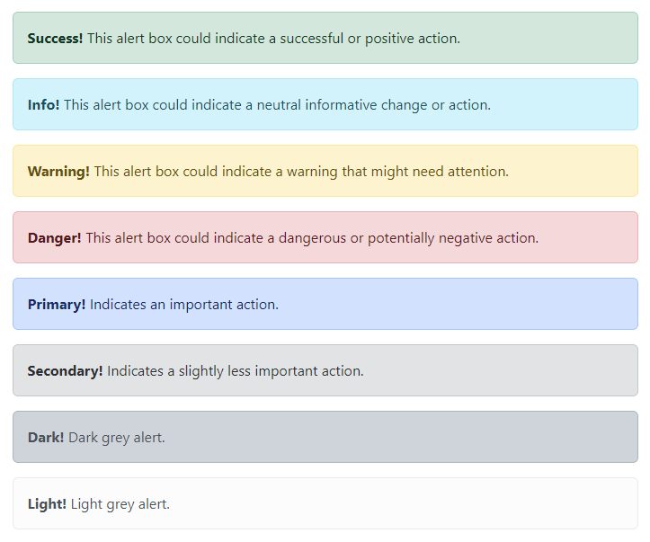

- Alerts are created with the `.alert` class, followed by one of the contextual classes `.alert-success`, `.alert-info`, `.alert-warning`, `.alert-danger`, `.alert-primary`, `.alert-secondary`, `.alert-light` or `.alert-dark`.

    ```html
    <div class="alert alert-success">
        <strong>Success!</strong> Indicates a successful or positive action.
    </div>
    ```

    [Try It Yourself](https://www.w3schools.com/bootstrap5/tryit.asp?filename=trybs_alerts&stacked=h)

## Alert Links

- Add the `.alert-link` class to any links inside the alert box to create "matching colored links":

    ```html
    <div class="alert alert-success">
        <strong>Success!</strong> You should <a href="#" class="alert-link">read this message</a>.
    </div>
    ```

    [Try It Yourself](https://www.w3schools.com/bootstrap5/tryit.asp?filename=trybs_alerts_link&stacked=h)

## Closing Alerts

- To close the alert message, add a `.alert-dismissible` class to the alert container. Then add `class="btn-close"` and `data-bs-dismiss="alert"` to a link or a button element (when you click on this the alert box will disappear).

    ```html
    <div class="alert alert-success alert-dismissible">
        <button type="button" class="btn-close" data-bs-dismiss="alert"></button>
        <strong>Success!</strong> This alert box could indicate a successful or positive action.
    </div>
    ```

## Animated Alerts

- The `.fade` and `.show` classes adds a fading effect when closing the alert message:

    ```html
    <div class="alert alert-danger alert-dismissible fade show">
    ```

</details>

# Bootstrap 5 Buttons

<details>
  <summary>click to expand</summary>

## Button Styles

- Bootstrap 5 provides different styles of buttons:

    ```html
    <button type="button" class="btn">Basic</button>
    <button type="button" class="btn btn-primary">Primary</button>
    <button type="button" class="btn btn-secondary">Secondary</button>
    <button type="button" class="btn btn-success">Success</button>
    <button type="button" class="btn btn-info">Info</button>
    <button type="button" class="btn btn-warning">Warning</button>
    <button type="button" class="btn btn-danger">Danger</button>
    <button type="button" class="btn btn-dark">Dark</button>
    <button type="button" class="btn btn-light">Light</button>
    <button type="button" class="btn btn-link">Link</button>
    ```

    [Try It Yourself](https://www.w3schools.com/bootstrap5/tryit.asp?filename=trybs_button_styles&stacked=h)

- The button classes can be used on `<a>`, `<button>`, or `<input>` elements:

    ```html
    <a href="#" class="btn btn-success">Link Button</a>
    <button type="button" class="btn btn-success">Button</button>
    <input type="button" class="btn btn-success" value="Input Button">
    <input type="submit" class="btn btn-success" value="Submit Button">
    <input type="reset" class="btn btn-success" value="Reset Button">
    ```

    [Try It Yourself](https://www.w3schools.com/bootstrap5/tryit.asp?filename=trybs_button_elements&stacked=h)

## Button Outline

- Bootstrap 5 also provides eight outline/bordered buttons.

- Move the mouse over them to see an additional `hover` effect:

    ```html
    <button type="button" class="btn btn-outline-primary">Primary</button>
    <button type="button" class="btn btn-outline-secondary">Secondary</button>
    <button type="button" class="btn btn-outline-success">Success</button>
    <button type="button" class="btn btn-outline-info">Info</button>
    <button type="button" class="btn btn-outline-warning">Warning</button>
    <button type="button" class="btn btn-outline-danger">Danger</button>
    <button type="button" class="btn btn-outline-dark">Dark</button>
    <button type="button" class="btn btn-outline-light text-dark">Light</button>
    ```

    [Try It Yourself](https://www.w3schools.com/bootstrap5/tryit.asp?filename=trybs_button_outline&stacked=h)

## Button Sizes

- Use the `.btn-lg` class for large buttons or `.btn-sm` class for small buttons:

    ```html
    <button type="button" class="btn btn-primary btn-lg">Large</button>
    <button type="button" class="btn btn-primary">Default</button>
    <button type="button" class="btn btn-primary btn-sm">Small</button>
    ```

    [Try It Yourself](https://www.w3schools.com/bootstrap5/tryit.asp?filename=trybs_button_sizes&stacked=h)

## Block Level Buttons

- To create a block level button that spans the entire width of the parent element, use the .d-grid "helper" class on the parent element:

    ```html
    <div class="d-grid">
        <button type="button" class="btn btn-primary btn-block">Full-Width Button</button>
    </div>
    ```

    [Try It Yourself](https://www.w3schools.com/bootstrap5/tryit.asp?filename=trybs_button_block&stacked=h)

- If you have many block-level buttons, you can control the space between them with the `.gap-*` class:

    ```html
    <div class="d-grid gap-3">
        <button type="button" class="btn btn-primary btn-block">Full-Width Button</button>
        <button type="button" class="btn btn-primary btn-block">Full-Width Button</button>
        <button type="button" class="btn btn-primary btn-block">Full-Width Button</button>
    </div>
    ```

## Active/Disabled Buttons

- A button can be set to an active (appear pressed) or a disabled (unclickable) state:

- The class `.active` makes a button appear pressed, and the `disabled` attribute makes a button unclickable. Note that `<a>` elements do not support the disabled attribute and must therefore use the `.disabled` class to make it visually appear disabled.

    ```html
    <button type="button" class="btn btn-primary active">Active Primary</button>
    <button type="button" class="btn btn-primary" disabled>Disabled Primary</button>
    <a href="#" class="btn btn-primary disabled">Disabled Link</a>
    ```

    [Try It Yourself](https://www.w3schools.com/bootstrap5/tryit.asp?filename=trybs_button_active&stacked=h)

## Spinner Buttons

- You can also add `spinners` to a button, which you will learn more about in our [BS5 Spinners Tutorial](https://www.w3schools.com/bootstrap5/bootstrap_spinners.php):

    ```html
    <button class="btn btn-primary">
        <span class="spinner-border spinner-border-sm"></span>
    </button>

    <button class="btn btn-primary">
        <span class="spinner-border spinner-border-sm"></span>
        Loading..
    </button>

    <button class="btn btn-primary" disabled>
        <span class="spinner-border spinner-border-sm"></span>
        Loading..
    </button>

    <button class="btn btn-primary" disabled>
        <span class="spinner-grow spinner-grow-sm"></span>
        Loading..
    </button>
    ```

</details>

# Bootstrap 5 Button Groups

<details>
  <summary>click to expand</summary>

## Button Groups

- Bootstrap 5 allows you to group a series of buttons together (on a single line) in a button group:

- Use a `<div>` element with class `.btn-group` to create a button group:

    ```html
    <div class="btn-group">
        <button type="button" class="btn btn-primary">Apple</button>
        <button type="button" class="btn btn-primary">Samsung</button>
        <button type="button" class="btn btn-primary">Sony</button>
    </div>
    ```

    [Try It Yourself](https://www.w3schools.com/bootstrap5/tryit.asp?filename=trybs_button_group&stacked=h)

- Tip: Instead of applying button sizes to every button in a group, use class `.btn-group-lg` for a large button group or the `.btn-group-sm` for a small button group:

    ```html
    <div class="btn-group btn-group-lg">
        <button type="button" class="btn btn-primary">Apple</button>
        <button type="button" class="btn btn-primary">Samsung</button>
        <button type="button" class="btn btn-primary">Sony</button>
    </div>
    ```

    [Try It Yourself](https://www.w3schools.com/bootstrap5/tryit.asp?filename=trybs_button_group_size&stacked=h)

## Vertical Button Groups

- Bootstrap 5 also supports vertical button groups:

- Use the class `.btn-group-vertical` to create a vertical button group:

    ```html
    <div class="btn-group-vertical">
        <button type="button" class="btn btn-primary">Apple</button>
        <button type="button" class="btn btn-primary">Samsung</button>
        <button type="button" class="btn btn-primary">Sony</button>
    </div>
    ```

    [Try It Yourself](https://www.w3schools.com/bootstrap5/tryit.asp?filename=trybs_button_group_v&stacked=h)

## Button Groups Side by Side

- Button groups are `inline` by default, which makes them appear side by side when you have multiple groups:

    ```html
    <div class="btn-group">
        <button type="button" class="btn btn-primary">Apple</button>
        <button type="button" class="btn btn-primary">Samsung</button>
        <button type="button" class="btn btn-primary">Sony</button>
    </div>

    <div class="btn-group">
        <button type="button" class="btn btn-primary">BMW</button>
        <button type="button" class="btn btn-primary">Mercedes</button>
        <button type="button" class="btn btn-primary">Volvo</button>
    </div>
    ```

    [Try It Yourself](https://www.w3schools.com/bootstrap5/tryit.asp?filename=trybs_button_group_inline&stacked=h)

## Nesting Button Groups & Dropdown Menus

- Nest button groups to create dropdown menus (you will learn more about dropdowns in a later chapter):

    ```html
    <div class="btn-group">
        <button type="button" class="btn btn-primary">Apple</button>
        <button type="button" class="btn btn-primary">Samsung</button>
        <div class="btn-group">
            <button type="button" class="btn btn-primary dropdown-toggle" data-bs-toggle="dropdown">Sony</button>
            <div class="dropdown-menu">
                <a class="dropdown-item" href="#">Tablet</a>
                <a class="dropdown-item" href="#">Smartphone</a>
            </div>
        </div>
    </div>
    ```

    [Try It Yourself](https://www.w3schools.com/bootstrap5/tryit.asp?filename=trybs_button_group_dropdown&stacked=h)

</details>

# Bootstrap 5 Badges

<details>
  <summary>click to expand</summary>

## Badges

- Badges are used to add additional information to any content:

- Use the `.badge` class together with a contextual class (like `.bg-secondary`) within `<span>` elements to create rectangular badges. Note that badges scale to match the size of the parent element (if any):

    ```html
    <h1>Example heading <span class="badge bg-secondary">New</span></h1>
    <h2>Example heading <span class="badge bg-secondary">New</span></h2>
    <h3>Example heading <span class="badge bg-secondary">New</span></h3>
    <h4>Example heading <span class="badge bg-secondary">New</span></h4>
    <h5>Example heading <span class="badge bg-secondary">New</span></h5>
    <h6>Example heading <span class="badge bg-secondary">New</span></h6>
    ```

    [Try It Yourself](https://www.w3schools.com/bootstrap5/tryit.asp?filename=trybs_badges&stacked=h)

## Contextual Badges

- Use any of the contextual classes (`.bg-*`) to change the color of a badge:

    ```html
    <span class="badge bg-primary">Primary</span>
    <span class="badge bg-secondary">Secondary</span>
    <span class="badge bg-success">Success</span>
    <span class="badge bg-danger">Danger</span>
    <span class="badge bg-warning">Warning</span>
    <span class="badge bg-info">Info</span>
    <span class="badge bg-light">Light</span>
    <span class="badge bg-dark">Dark</span>
    ```

    [Try It Yourself](https://www.w3schools.com/bootstrap5/tryit.asp?filename=trybs_badges2&stacked=h)

## Pill Badges

- Use the `.rounded-pill` class to make the badges more round:

    ```html
    <span class="badge rounded-pill bg-primary">Primary</span>
    <span class="badge rounded-pill bg-secondary">Secondary</span>
    <span class="badge rounded-pill bg-success">Success</span>
    <span class="badge rounded-pill bg-danger">Danger</span>
    <span class="badge rounded-pill bg-warning">Warning</span>
    <span class="badge rounded-pill bg-info">Info</span>
    <span class="badge rounded-pill bg-light">Light</span>
    <span class="badge rounded-pill bg-dark">Dark</span>
    ```

    [Try It Yourself](https://www.w3schools.com/bootstrap5/tryit.asp?filename=trybs_badges_pills&stacked=h)

## Badge inside an Element

- An example of using a badge inside a button:

    ```html
    <button type="button" class="btn btn-primary">
        Messages <span class="badge bg-danger">4</span>
    </button>
    ```

    [Try It Yourself](https://www.w3schools.com/bootstrap5/tryit.asp?filename=trybs_badges_button&stacked=h)

</details>

# Bootstrap 5 Progress Bars

<details>
  <summary>click to expand</summary>

## Basic Progress Bar

- A progress bar can be used to show how far a user is in a process.

- To create a default progress bar, add a `.progress` class to a container element and add the `.progress-bar` class to its child element. Use the CSS width property to set the width of the progress bar:

    ```html
    <div class="progress">
        <div class="progress-bar" style="width:70%"></div>
    </div>
    ```

    [Try It Yourself](https://www.w3schools.com/bootstrap5/tryit.asp?filename=trybs_progressbar1&stacked=h)

## Progress Bar Height

- The height of the progress bar is `1rem` (usually `16px`) by default. Use the CSS height property to change it:

    ```html
    <div class="progress" style="height:20px">
        <div class="progress-bar" style="width:40%;"></div>
    </div>
    ```

    [Try It Yourself](https://www.w3schools.com/bootstrap5/tryit.asp?filename=trybs_progressbar7&stacked=h)

## Progress Bar Labels

- Add text inside the progress bar to show the visible percentage:

    ```html
    <div class="progress">
        <div class="progress-bar" style="width:70%">70%</div>
    </div>
    ```

    [Try It Yourself](https://www.w3schools.com/bootstrap5/tryit.asp?filename=trybs_progressbar2&stacked=h)

## Colored Progress Bars

- By default, the progress bar is blue (primary). Use any of the contextual background classes to change its color:

    ```html
    <!-- Blue -->
    <div class="progress">
        <div class="progress-bar" style="width:10%"></div>
    </div>

    <!-- Green -->
    <div class="progress">
        <div class="progress-bar bg-success" style="width:20%"></div>
    </div>

    <!-- Turquoise -->
    <div class="progress">
        <div class="progress-bar bg-info" style="width:30%"></div>
    </div>

    <!-- Orange -->
    <div class="progress">
        <div class="progress-bar bg-warning" style="width:40%"></div>
    </div>

    <!-- Red -->
    <div class="progress">
        <div class="progress-bar bg-danger" style="width:50%"></div>
    </div>

    <!-- White -->
    <div class="progress border">
        <div class="progress-bar bg-white" style="width:60%"></div>
    </div>

    <!-- Grey -->
    <div class="progress">
        <div class="progress-bar bg-secondary" style="width:70%"></div>
    </div>

    <!-- Light Grey -->
    <div class="progress border">
        <div class="progress-bar bg-light" style="width:80%"></div>
    </div>

    <!-- Dark Grey -->
    <div class="progress">
        <div class="progress-bar bg-dark" style="width:90%"></div>
    </div>
    ```

    [Try It Yourself](https://www.w3schools.com/bootstrap5/tryit.asp?filename=trybs_progressbar3&stacked=h)

## Striped Progress Bars

- Use the `.progress-bar-striped` class to add stripes to the progress bars:

    ```html
    <div class="progress">
        <div class="progress-bar progress-bar-striped" style="width:40%"></div>
    </div>
    ```

    [Try It Yourself](https://www.w3schools.com/bootstrap5/tryit.asp?filename=trybs_progressbar4&stacked=h)

## Animated Progress Bar

- Add the `.progress-bar-animated` class to animate the progress bar:

    ```html
    <div class="progress">
        <div class="progress-bar progress-bar-striped progress-bar-animated" style="width:40%"></div>
    </div>
    ```

    [Try It Yourself](https://www.w3schools.com/bootstrap5/tryit.asp?filename=trybs_progressbar5&stacked=h)

## Multiple Progress Bars

- Progress bars can also be stacked:

    ```html
    <div class="progress">
        <div class="progress-bar bg-success" style="width:40%">
            Free Space
        </div>
        <div class="progress-bar bg-warning" style="width:10%">
            Warning
        </div>
        <div class="progress-bar bg-danger" style="width:20%">
            Danger
        </div>
    </div>
    ```

    [Try It Yourself](https://www.w3schools.com/bootstrap5/tryit.asp?filename=trybs_progressbar6&stacked=h)

</details>

# Bootstrap 5 Spinners

<details>
  <summary>click to expand</summary>

## Spinners

- To create a spinner/loader, use the `.spinner-border` class:

    ```html
    <div class="spinner-border"></div>
    ```

    [Try It Yourself](https://www.w3schools.com/bootstrap5/tryit.asp?filename=trybs_spinners&stacked=h)

## Colored Spinners

- Use any text color utilites to add a color to the spinner:

    ```html
    <div class="spinner-border text-muted"></div>
    <div class="spinner-border text-primary"></div>
    <div class="spinner-border text-success"></div>
    <div class="spinner-border text-info"></div>
    <div class="spinner-border text-warning"></div>
    <div class="spinner-border text-danger"></div>
    <div class="spinner-border text-secondary"></div>
    <div class="spinner-border text-dark"></div>
    <div class="spinner-border text-light"></div>
    ```

    [Try It Yourself](https://www.w3schools.com/bootstrap5/tryit.asp?filename=trybs_spinners_colors&stacked=h)

## Growing Spinners

- Use the `.spinner-grow` class if you want the spinner/loader to grow instead of `spin`

    ```html
    <div class="spinner-grow text-muted"></div>
    <div class="spinner-grow text-primary"></div>
    <div class="spinner-grow text-success"></div>
    <div class="spinner-grow text-info"></div>
    <div class="spinner-grow text-warning"></div>
    <div class="spinner-grow text-danger"></div>
    <div class="spinner-grow text-secondary"></div>
    <div class="spinner-grow text-dark"></div>
    <div class="spinner-grow text-light"></div>
    ```

    [Try It Yourself](https://www.w3schools.com/bootstrap5/tryit.asp?filename=trybs_spinners_grow&stacked=h)

## Spinner Size

- Use `.spinner-border-sm` or `.spinner-grow-sm` to create a smaller spinner:

    ```html
    <div class="spinner-border spinner-border-sm"></div>
    <div class="spinner-grow spinner-grow-sm"></div>
    ```

    [Try It Yourself](https://www.w3schools.com/bootstrap5/tryit.asp?filename=trybs_spinners_size&stacked=h)

## Spinner Buttons

- You can also add spinners to a button, with or without text:

    ```html
    <button class="btn btn-primary">
        <span class="spinner-border spinner-border-sm"></span>
    </button>

    <button class="btn btn-primary">
        <span class="spinner-border spinner-border-sm"></span>
        Loading..
    </button>

    <button class="btn btn-primary" disabled>
        <span class="spinner-border spinner-border-sm"></span>
        Loading..
    </button>

    <button class="btn btn-primary" disabled>
        <span class="spinner-grow spinner-grow-sm"></span>
        Loading..
    </button>
    ```

    [Try It Yourself](https://www.w3schools.com/bootstrap5/tryit.asp?filename=trybs_spinners_buttons&stacked=h)

</details>

# Bootstrap 5 Pagination

<details>
  <summary>click to expand</summary>

## Basic Pagination

- If you have a web site with lots of pages, you may wish to add some sort of pagination to each page.

- To create a basic pagination, add the `.pagination` class to an `<ul>` element. Then add the `.page-item` to each `<li>` element and a `.page-link` class to each link inside `<li>`:

    ```html
    <ul class="pagination">
        <li class="page-item"><a class="page-link" href="#">Previous</a></li>
        <li class="page-item"><a class="page-link" href="#">1</a></li>
        <li class="page-item"><a class="page-link" href="#">2</a></li>
        <li class="page-item"><a class="page-link" href="#">3</a></li>
        <li class="page-item"><a class="page-link" href="#">Next</a></li>
    </ul>
    ```

    [Try It Yourself](https://www.w3schools.com/bootstrap5/tryit.asp?filename=trybs_pagination&stacked=h)

## Active State

- The `.active` class is used to `highlight` the current page:

    ```html
    <ul class="pagination">
        <li class="page-item"><a class="page-link" href="#">Previous</a></li>
        <li class="page-item"><a class="page-link" href="#">1</a></li>
        <li class="page-item active"><a class="page-link" href="#">2</a></li>
        <li class="page-item"><a class="page-link" href="#">3</a></li>
        <li class="page-item"><a class="page-link" href="#">Next</a></li>
    </ul>
    ```

    [Try It Yourself](https://www.w3schools.com/bootstrap5/tryit.asp?filename=trybs_pagination_active&stacked=h)

## Disabled State

- The `.disabled` class is used for un-clickable links:

    ```html
    <ul class="pagination">
        <li class="page-item disabled"><a class="page-link" href="#">Previous</a></li>
        <li class="page-item"><a class="page-link" href="#">1</a></li>
        <li class="page-item"><a class="page-link" href="#">2</a></li>
        <li class="page-item"><a class="page-link" href="#">3</a></li>
        <li class="page-item"><a class="page-link" href="#">Next</a></li>
    </ul>
    ```

    [Try It Yourself](https://www.w3schools.com/bootstrap5/tryit.asp?filename=trybs_pagination_disabled&stacked=h)

## Pagination Sizing

- Pagination blocks can also be sized to a larger or a smaller size.

- Add class `.pagination-lg` for larger blocks or `.pagination-sm` for smaller blocks:

    ```html
    <ul class="pagination pagination-lg">
        <li class="page-item"><a class="page-link" href="#">Previous</a></li>
        <li class="page-item"><a class="page-link" href="#">1</a></li>
        <li class="page-item"><a class="page-link" href="#">2</a></li>
        <li class="page-item"><a class="page-link" href="#">3</a></li>
        <li class="page-item"><a class="page-link" href="#">Next</a></li>
    </ul>

    <ul class="pagination pagination-sm">
        <li class="page-item"><a class="page-link" href="#">Previous</a></li>
        <li class="page-item"><a class="page-link" href="#">1</a></li>
        <li class="page-item"><a class="page-link" href="#">2</a></li>
        <li class="page-item"><a class="page-link" href="#">3</a></li>
        <li class="page-item"><a class="page-link" href="#">Next</a></li>
    </ul>
    ```

## Pagination Alignment

- Use utility classes to change the alignment of the pagination:

    ```html
    <!-- Default (left-aligned) -->
    <ul class="pagination" style="margin:20px 0">
        <li class="page-item">...</li>
    </ul>

    <!-- Center-aligned -->
    <ul class="pagination justify-content-center" style="margin:20px 0">
        <li class="page-item">...</li>
    </ul>

    <!-- Right-aligned -->
    <ul class="pagination justify-content-end" style="margin:20px 0">
        <li class="page-item">...</li>
    </ul>
    ```

    [Try It Yourself](https://www.w3schools.com/bootstrap5/tryit.asp?filename=trybs_pagination_alignment&stacked=h)

## Breadcrumbs

- Another form for `pagination`, is `breadcrumbs`:

- The `.breadcrumb` and `.breadcrumb-item` classes indicates the current page's location within a navigational hierarchy:

    ```html
    <ul class="breadcrumb">
        <li class="breadcrumb-item"><a href="#">Photos</a></li>
        <li class="breadcrumb-item"><a href="#">Summer 2017</a></li>
        <li class="breadcrumb-item"><a href="#">Italy</a></li>
        <li class="breadcrumb-item active">Rome</li>
    </ul>
    ```

    [Try It Yourself](https://www.w3schools.com/bootstrap5/tryit.asp?filename=trybs_breadcrumbs&stacked=h)

</details>

# Bootstrap 5 List Groups

<details>
  <summary>click to expand</summary>

## Basic List Groups

- The most basic list group is an unordered list with list items:

- To create a basic list group, use an `<ul>` element with class `.list-group`, and `<li>` elements with class `.list-group-item`:

    ```html
    <ul class="list-group">
        <li class="list-group-item">First item</li>
        <li class="list-group-item">Second item</li>
        <li class="list-group-item">Third item</li>
    </ul>
    ```

    [Try It Yourself](https://www.w3schools.com/bootstrap5/tryit.asp?filename=trybs_list_group&stacked=h)

## Active State

- Use the `.active` class to highlight the current item:

    ```html
    <ul class="list-group">
        <li class="list-group-item active">Active item</li>
        <li class="list-group-item">Second item</li>
        <li class="list-group-item">Third item</li>
    </ul>
    ```

    [Try It Yourself](https://www.w3schools.com/bootstrap5/tryit.asp?filename=trybs_list_group_active&stacked=h)

## List Group With Linked Items

- To create a list group with linked items, use `<div>` instead of `<ul>` and `<a>` instead of `<li>`. Optionally, add the `.list-group-item-action` class if you want a grey background color on hover:

    ```html
    <div class="list-group">
        <a href="#" class="list-group-item list-group-item-action">First item</a>
        <a href="#" class="list-group-item list-group-item-action">Second item</a>
        <a href="#" class="list-group-item list-group-item-action">Third item</a>
    </div>
    ```

    [Try It Yourself](https://www.w3schools.com/bootstrap5/tryit.asp?filename=trybs_list_group_link&stacked=h)

## Disabled Item

- The `.disabled` class adds a lighter text color to the disabled item. And when used on links, it will remove the hover effect:

    ```html
    <div class="list-group">
        <a href="#" class="list-group-item disabled">Disabled item</a>
        <a href="#" class="list-group-item disabled">Disabled item</a>
        <a href="#" class="list-group-item">Third item</a>
    </div>
    ```

    [Try It Yourself](https://www.w3schools.com/bootstrap5/tryit.asp?filename=trybs_list_group_disabled&stacked=h)

## Flush / Remove Borders

- Use the `.list-group-flush` class to remove some borders and rounded corners:

    ```html
    <ul class="list-group list-group-flush">
        <li class="list-group-item">First item</li>
        <li class="list-group-item">Second item</li>
        <li class="list-group-item">Third item</li>
        <li class="list-group-item">Fourth item</li>
    </ul>
    ```

    [Try It Yourself](https://www.w3schools.com/bootstrap5/tryit.asp?filename=trybs_list_group_flush&stacked=h)

## Numbered List Groups

- Use the `.list-group-numbered` class to create list items with numbers in front of them:

    ```html
    <ol class="list-group list-group-numbered">
        <li class="list-group-item">First item</li>
        <li class="list-group-item">Second item</li>
        <li class="list-group-item">Third item</li>
    </ol>
    ```

    [Try It Yourself](https://www.w3schools.com/bootstrap5/tryit.asp?filename=trybs_list_group_numbered&stacked=h)

## Horizontal List Groups

- If you want the list items to display horizontally instead of vertically (side by side instead of on top of each other), add the `.list-group-horizontal` class to `.list-group`:

    ```html
    <ul class="list-group list-group-horizontal">
        <li class="list-group-item">First item</li>
        <li class="list-group-item">Second item</li>
        <li class="list-group-item">Third item</li>
        <li class="list-group-item">Fourth item</li>
    </ul>
    ```

    [Try It Yourself](https://www.w3schools.com/bootstrap5/tryit.asp?filename=trybs_list_group_horizontal&stacked=h)

## Contextual Classes

- Contextual classes can be used to add color to the list items

- The classes for coloring list-items are: `.list-group-item-success`, `.list-group-item-secondary`, `.list-group-item-info`, `.list-group-item-warning`, `.list-group-item-danger`, `.list-group-item-primary`, `.list-group-item-dark` and `.list-group-item-light`:

    ```html
    <ul class="list-group">
        <li class="list-group-item list-group-item-success">Success item</li>
        <li class="list-group-item list-group-item-secondary">Secondary item</li>
        <li class="list-group-item list-group-item-info">Info item</li>
        <li class="list-group-item list-group-item-warning">Warning item</li>
        <li class="list-group-item list-group-item-danger">Danger item</li>
        <li class="list-group-item list-group-item-primary">Primary item</li>
        <li class="list-group-item list-group-item-dark">Dark item</li>
        <li class="list-group-item list-group-item-light">Light item</li>
    </ul>
    ```

    [Try It Yourself](https://www.w3schools.com/bootstrap5/tryit.asp?filename=trybs_list_group_context&stacked=h)

## Link items with Contextual Classes

- Move the mouse over the linked items to see the hover effect

    ```html
    <div class="list-group">
        <a href="#" class="list-group-item list-group-item-action">Action item</a>
        <a href="#" class="list-group-item list-group-item-action list-group-item-success">Success item</a>
        <a href="#" class="list-group-item list-group-item-action list-group-item-secondary">Secondary item</a>
        <a href="#" class="list-group-item list-group-item-action list-group-item-info">Info item</a>
        <a href="#" class="list-group-item list-group-item-action list-group-item-warning">Warning item</a>
        <a href="#" class="list-group-item list-group-item-action list-group-item-danger">Danger item</a>
        <a href="#" class="list-group-item list-group-item-action list-group-item-primary">Primary item</a>
        <a href="#" class="list-group-item list-group-item-action list-group-item-dark">Dark item</a>
        <a href="#" class="list-group-item list-group-item-action list-group-item-light">Light item</a>
    </div>
    ```

    [Try It Yourself](https://www.w3schools.com/bootstrap5/tryit.asp?filename=trybs_list_group_context_links&stacked=h)

## List Group with Badges

- Combine `.badge` classes with utility/helper classes to add badges inside the list group:

    ```html
    <ul class="list-group">
        <li class="list-group-item d-flex justify-content-between align-items-center">
            Inbox
            <span class="badge bg-primary rounded-pill">12</span>
        </li>
        <li class="list-group-item d-flex justify-content-between align-items-center">
            Ads
            <span class="badge bg-primary rounded-pill">50</span>
        </li>
        <li class="list-group-item d-flex justify-content-between align-items-center">
            Junk
            <span class="badge bg-primary rounded-pill">99</span>
        </li>
    </ul>
    ```

    [Try It Yourself](https://www.w3schools.com/bootstrap5/tryit.asp?filename=trybs_list_group_badge&stacked=h)

</details>

# Bootstrap 5 Cards

<details>
  <summary>click to expand</summary>

## Cards

- A card in Bootstrap 5 is a bordered box with some padding around its content. It includes options for headers, footers, content, colors, etc.


## Basic Card

- A basic card is created with the `.card` class, and content inside the card has a `.card-body` class:

    ```html
    <div class="card">
        <div class="card-body">Basic card</div>
    </div>
    ```

    [Try It Yourself](https://www.w3schools.com/bootstrap5/tryit.asp?filename=trybs_card&stacked=h)

## Header and Footer

- The `.card-header` class adds a heading to the card and the `.card-footer` class adds a footer to the card:

    ```html
    <div class="card">
        <div class="card-header">Header</div>
        <div class="card-body">Content</div>
        <div class="card-footer">Footer</div>
    </div>
    ```

    [Try It Yourself](https://www.w3schools.com/bootstrap5/tryit.asp?filename=trybs_card_header&stacked=h)

## Contextual Cards

- To add a background color to the card, use contextual classes (`.bg-primary`, `.bg-success`, `.bg-info`, `.bg-warning`, `.bg-danger`, `.bg-secondary`, `.bg-dark` and `.bg-light`).

    ```html
    <div class="card">
        <div class="card-body">Basic card</div>
    </div>
    <div class="card bg-primary text-white">
        <div class="card-body">Primary card</div>
    </div>
    <div class="card bg-success text-white">
        <div class="card-body">Success card</div>
    </div>
    <div class="card bg-info text-white">
        <div class="card-body">Info card</div>
    </div>
    <div class="card bg-warning text-white">
        <div class="card-body">Warning card</div>
    </div>
    <div class="card bg-danger text-white">
        <div class="card-body">Danger card</div>
    </div>
    <div class="card bg-secondary text-white">
        <div class="card-body">Secondary card</div>
    </div>
    <div class="card bg-dark text-white">
        <div class="card-body">Dark card</div>
    </div>
    <div class="card bg-light text-dark">
        <div class="card-body">Light card</div>
    </div>
    ```

    [Try It Yourself](https://www.w3schools.com/bootstrap5/tryit.asp?filename=trybs_card_contextual&stacked=h)

## Titles, text, and links

- Use `.card-title` to add card titles to any heading element. The `.card-text` class is used to remove bottom margins for a `<p>` element if it is the last child (or the only one) inside `.card-body`. The `.card-link` class adds a blue color to any link, and a hover effect.

    ```html
    <div class="card">
        <div class="card-body">
            <h4 class="card-title">Card title</h4>
            <p class="card-text">Some example text. Some example text.</p>
            <a href="#" class="card-link">Card link</a>
            <a href="#" class="card-link">Another link</a>
        </div>
    </div>
    ```

    [Try It Yourself](https://www.w3schools.com/bootstrap5/tryit.asp?filename=trybs_card_title&stacked=h)

## Card Images

- Add `.card-img-top` or `.card-img-bottom` to an `` to place the image at the top or at the bottom inside the card. Note that we have added the image outside of the `.card-body` to span the entire width:

    ```html
    <div class="card" style="width:400px">
        
        <div class="card-body">
            <h4 class="card-title">John Doe</h4>
            <p class="card-text">Some example text.</p>
            <a href="#" class="btn btn-primary">See Profile</a>
        </div>
    </div>
    ```

    [Try It Yourself](https://www.w3schools.com/bootstrap5/tryit.asp?filename=trybs_card_image&stacked=h)

## Card Image Overlays

- Turn an image into a card background and use `.card-img-overlay` to add text on top of the image:

    ```html
    <div class="card" style="width:500px">
        
        <div class="card-img-overlay">
            <h4 class="card-title">John Doe</h4>
            <p class="card-text">Some example text.</p>
            <a href="#" class="btn btn-primary">See Profile</a>
        </div>
    </div>
    ```

    [Try It Yourself](https://www.w3schools.com/bootstrap5/tryit.asp?filename=trybs_card_image_overlay&stacked=h)

</details>

# Bootstrap 5 Dropdowns

<details>
  <summary>click to expand</summary>

## Basic Dropdown

- A dropdown menu is a toggleable menu that allows the user to choose one value from a predefined list:

    ```html
    <div class="dropdown">
        <button type="button" class="btn btn-primary dropdown-toggle" data-bs-toggle="dropdown">
            Dropdown button
        </button>
        <ul class="dropdown-menu">
            <li><a class="dropdown-item" href="#">Link 1</a></li>
            <li><a class="dropdown-item" href="#">Link 2</a></li>
            <li><a class="dropdown-item" href="#">Link 3</a></li>
        </ul>
    </div>
    ```

    [Try It Yourself](https://www.w3schools.com/bootstrap5/tryit.asp?filename=trybs_dropdown-menu&stacked=h)

- The `.dropdown` class indicates a dropdown menu.

- To open the dropdown menu, use a button or a link with a class of `.dropdown-toggle` and the `data-bs-toggle="dropdown"` attribute.

- Add the `.dropdown-menu` class to a container element, like `<div>` or `<ul>`, to actually build the dropdown menu. Then add the `.dropdown-item` class to each element (links or buttons) inside the dropdown menu.

## Dropdown Divider

- The `.dropdown-divider` class is used to separate links inside the dropdown menu with a thin horizontal border:

    ```html
    <li><hr class="dropdown-divider"></hr></li>
    ```

    [Try It Yourself](https://www.w3schools.com/bootstrap5/tryit.asp?filename=trybs_dropdown-divider&stacked=h)

## Dropdown Header

- The `.dropdown-header` class is used to add headers inside the dropdown menu:

    ```html
    <li><h5 class="dropdown-header">Dropdown header 1</h5></li>
    ```

    [Try It Yourself](https://www.w3schools.com/bootstrap5/tryit.asp?filename=trybs_dropdown-header&stacked=h)

## Disable and Active items

- Highlight a specific dropdown item with the `.active` class (adds a blue background color).

- To disable an item in the dropdown menu, use the `.disabled` class (gets a light-grey text color and a `no-parking-sign` icon on hover):

    ```html
    <li><a class="dropdown-item" href="#">Normal</a></li>
    <li><a class="dropdown-item active" href="#">Active</a></li>
    <li><a class="dropdown-item disabled" href="#">Disabled</a></li>
    ```

    [Try It Yourself](https://www.w3schools.com/bootstrap5/tryit.asp?filename=trybs_dropdown-active&stacked=h)

## Dropdown Position

- You can also create a `dropend` or `dropstart` menu, by adding the `.dropend` or `.dropstart` class to the dropdown element. Note that the caret/arrow is added automatically:

    ```html
    <div class="dropdown dropend">
    ```

    [Try It Yourself](https://www.w3schools.com/bootstrap5/tryit.asp?filename=trybs_dropdown-right&stacked=h)

    ```html
    <div class="dropdown dropstart">
    ```

    [Try It Yourself](https://www.w3schools.com/bootstrap5/tryit.asp?filename=trybs_dropdown-left&stacked=h)

## Dropdown Menu Bottom Left-Right

- To right-align the dropdown menu, add the `.dropdown-menu-end` class to the element with `.dropdown-menu`:

    ```html
    <div class="dropdown-menu dropdown-menu-end">
    ```

    [Try It Yourself](https://www.w3schools.com/bootstrap5/tryit.asp?filename=trybs_dropdown-menu-right&stacked=h)

    ```html
    <div class="dropdown-menu dropdown-menu-start">
    ```

## Dropup

- If you want the dropdown menu to expand upwards instead of downwards, change the `<div>` element with `class="dropdown"` to `"dropup"`:

    ```html
    <div class="dropup">
    ```

    [Try It Yourself](https://www.w3schools.com/bootstrap5/tryit.asp?filename=trybs_dropdown-menu-dropup&stacked=h)

## Dropdown Text

- The `.dropdown-item-text` class is used to add plain text to a dropdown item, or used on links for default link styling.

    ```html
    <ul class="dropdown-menu">
        <li><a class="dropdown-item" href="#">Link 1</a></li>
        <li><a class="dropdown-item" href="#">Link 2</a></li>
        <li><a class="dropdown-item" href="#">Link 3</a></li>
        <li><a class="dropdown-item-text" href="#">Text Link</a></li>
        <li><span class="dropdown-item-text">Just Text</span></li>
    </ul>
    ```

    [Try It Yourself](https://www.w3schools.com/bootstrap5/tryit.asp?filename=trybs_dropdown-text&stacked=h)

## Grouped Buttons with a Dropdown

- Grouped Buttons with a Dropdown

    ```html
    <div class="btn-group">
        <button type="button" class="btn btn-primary">Apple</button>
        <button type="button" class="btn btn-primary">Samsung</button>
        <div class="btn-group">
            <button type="button" class="btn btn-primary dropdown-toggle" data-bs-toggle="dropdown">Sony</button>
            <ul class="dropdown-menu">
                <li><a class="dropdown-item" href="#">Tablet</a></li>
                <li><a class="dropdown-item" href="#">Smartphone</a></li>
            </ul>
        </div>
    </div>
    ```

    [Try It Yourself](https://www.w3schools.com/bootstrap5/tryit.asp?filename=trybs_button_group_dropdown&stacked=h)

## Vertical Button Group w/ Dropdown

- Vertical Button Group w/ Dropdown

    ```html
    <div class="btn-group-vertical">
        <button type="button" class="btn btn-primary">Apple</button>
        <button type="button" class="btn btn-primary">Samsung</button>
        <div class="btn-group">
            <button type="button" class="btn btn-primary dropdown-toggle" data-bs-toggle="dropdown">Sony</button>
            <ul class="dropdown-menu">
                <li><a class="dropdown-item" href="#">Tablet</a></li>
                <li><a class="dropdown-item" href="#">Smartphone</a></li>
            </ul>
        </div>
    </div>
    ```

    [Try It Yourself](https://www.w3schools.com/bootstrap5/tryit.asp?filename=trybs_button_group_v_dropdown&stacked=h)

</details>

# Bootstrap 5 Collapse

<details>
  <summary>click to expand</summary>

## Basic Collapsible

- Collapsibles are useful when you want to hide and show large amount of content

- The `.collapse` class indicates a collapsible element (a `<div>` in our example); this is the content that will be shown or hidden with a click of a button.

- To control (show/hide) the collapsible content, add the `data-bs-toggle="collapse"` attribute to an `<a>` or a `<button>` element. Then add the `data-bs-target="#id"` attribute to connect the button with the collapsible content (`<div id="demo">`).

    ```html
    <button data-bs-toggle="collapse" data-bs-target="#demo">Collapsible</button>

    <div id="demo" class="collapse">
        Lorem ipsum dolor text....
    </div>
    ```

    [Try It Yourself](https://www.w3schools.com/bootstrap5/tryit.asp?filename=trybs_collapsible&stacked=h)

- Note: For `<a>` elements, you can use the `href` attribute instead of the `data-bs-target` attribute:

    ```html
    <a href="#demo" data-bs-toggle="collapse">Collapsible</a>

    <div id="demo" class="collapse">
        Lorem ipsum dolor text....
    </div>
    ```

    [Try It Yourself](https://www.w3schools.com/bootstrap5/tryit.asp?filename=trybs_collapsible2&stacked=h)

- By default, the collapsible content is hidden. However, you can add the `.show` class to show the content by default:

    ```html
    <div id="demo" class="collapse show">
        Lorem ipsum dolor text....
    </div>
    ```

    [Try It Yourself](https://www.w3schools.com/bootstrap5/tryit.asp?filename=trybs_collapsible_in&stacked=h)

## Accordion

- The following example shows a simple accordion by extending the card component.

- Note: Use the `data-bs-parent` attribute to make sure that all collapsible elements under the specified parent will be closed when one of the collapsible item is shown.

    ```html
    <div id="accordion">
        <div class="card">
            <div class="card-header">
                <a class="btn" data-bs-toggle="collapse" href="#collapseOne">
                    Collapsible Group Item #1
                </a>
            </div>
            <div id="collapseOne" class="collapse show" data-bs-parent="#accordion">
                <div class="card-body">
                    Lorem ipsum..
                </div>
            </div>
        </div>
        <div class="card">
            <div class="card-header">
                <a class="collapsed btn" data-bs-toggle="collapse" href="#collapseTwo">
                    Collapsible Group Item #2
                </a>
            </div>
            <div id="collapseTwo" class="collapse" data-bs-parent="#accordion">
                <div class="card-body">
                    Lorem ipsum..
                </div>
            </div>
        </div>
        <div class="card">
            <div class="card-header">
                <a class="collapsed btn" data-bs-toggle="collapse" href="#collapseThree">
                    Collapsible Group Item #3
                </a>
            </div>
            <div id="collapseThree" class="collapse" data-bs-parent="#accordion">
                <div class="card-body">
                    Lorem ipsum..
                </div>
            </div>
        </div>
    </div>
    ```

    [Try It Yourself](https://www.w3schools.com/bootstrap5/tryit.asp?filename=trybs_collapsible_accordion&stacked=h)

</details>

# Bootstrap 5 Navs

<details>
  <summary>click to expand</summary>

## Nav Menus

- If you want to create a simple horizontal menu, add the .nav class to a <ul> element, followed by .nav-item for each <li> and add the .nav-link class to their links:

    

    ```html
    <ul class="nav">
        <li class="nav-item">
            <a class="nav-link" href="#">Link</a>
        </li>
        <li class="nav-item">
            <a class="nav-link" href="#">Link</a>
        </li>
        <li class="nav-item">
            <a class="nav-link" href="#">Link</a>
        </li>
        <li class="nav-item">
            <a class="nav-link disabled" href="#">Disabled</a>
        </li>
    </ul>
    ```

    [Try It Yourself](https://www.w3schools.com/bootstrap5/tryit.asp?filename=trybs_nav&stacked=h)

## Aligned Nav

- Add the `.justify-content-center` class to center the nav, and the `.justify-content-end` class to right-align the nav.

    ```html
    <!-- Centered nav -->
    <ul class="nav justify-content-center">

    <!-- Right-aligned nav -->
    <ul class="nav justify-content-end">
    ```

    [Try It Yourself](https://www.w3schools.com/bootstrap5/tryit.asp?filename=trybs_nav_align&stacked=h)

## Vertical Nav

- Add the `.flex-column` class to create a vertical nav:

    ```html
    <ul class="nav flex-column">
    ```

    [Try It Yourself](https://www.w3schools.com/bootstrap5/tryit.asp?filename=trybs_nav_vertical&stacked=h)

## Tabs

- Turn the nav menu into navigation tabs with the `.nav-tabs` class. Add the .active class to the active/current link. If you want the tabs to be togglable, see the last example on this page.

    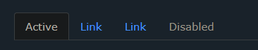

    ```html
    <ul class="nav nav-tabs">
        <li class="nav-item">
            <a class="nav-link active" href="#">Active</a>
        </li>
        <li class="nav-item">
            <a class="nav-link" href="#">Link</a>
        </li>
        <li class="nav-item">
            <a class="nav-link" href="#">Link</a>
        </li>
        <li class="nav-item">
            <a class="nav-link disabled" href="#">Disabled</a>
        </li>
    </ul>
    ```

    [Try It Yourself](https://www.w3schools.com/bootstrap5/tryit.asp?filename=trybs_nav_tabs&stacked=h)

## Pills

- Turn the nav menu into navigation pills with the `.nav-pills` class. If you want the pills to be togglable, see the last example on this page.

    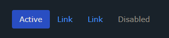

    ```html
    <ul class="nav nav-pills">
        <li class="nav-item">
            <a class="nav-link active" href="#">Active</a>
        </li>
        <li class="nav-item">
            <a class="nav-link" href="#">Link</a>
        </li>
        <li class="nav-item">
            <a class="nav-link" href="#">Link</a>
        </li>
        <li class="nav-item">
            <a class="nav-link disabled" href="#">Disabled</a>
        </li>
    </ul>
    ```

    [Try It Yourself](https://www.w3schools.com/bootstrap5/tryit.asp?filename=trybs_nav_pills&stacked=h)

## Justified Tabs/pills

- Justify the tabs/pills with the `.nav-justified` class (equal width):

    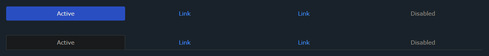

    ```html
    <ul class="nav nav-pills nav-justified">..</ul>
    <ul class="nav nav-tabs nav-justified">..</ul>
    ```

    [Try It Yourself](https://www.w3schools.com/bootstrap5/tryit.asp?filename=trybs_nav_justified&stacked=h)

## Pills with Dropdown

- Pills with Dropdown

    ```html
    <ul class="nav nav-pills">
        <li class="nav-item">
            <a class="nav-link active" href="#">Active</a>
        </li>
        <li class="nav-item dropdown">
            <a class="nav-link dropdown-toggle" data-bs-toggle="dropdown" href="#">Dropdown</a>
            <ul class="dropdown-menu">
                <li><a class="dropdown-item" href="#">Link 1</a></li>
                <li><a class="dropdown-item" href="#">Link 2</a></li>
                <li><a class="dropdown-item" href="#">Link 3</a></li>
            </ul>
        </li>
        <li class="nav-item">
            <a class="nav-link" href="#">Link</a>
        </li>
        <li class="nav-item">
            <a class="nav-link disabled" href="#">Disabled</a>
        </li>
    </ul>
    ```

    [Try It Yourself](https://www.w3schools.com/bootstrap5/tryit.asp?filename=trybs_nav_pills_dropdown&stacked=h)

## Tabs with Dropdown

- Tabs with Dropdown

    ```html
    <ul class="nav nav-tabs">
        <li class="nav-item">
            <a class="nav-link active" href="#">Active</a>
        </li>
        <li class="nav-item dropdown">
            <a class="nav-link dropdown-toggle" data-bs-toggle="dropdown" href="#">Dropdown</a>
            <ul class="dropdown-menu">
                <li><a class="dropdown-item" href="#">Link 1</a></li>
                <li><a class="dropdown-item" href="#">Link 2</a></li>
                <li><a class="dropdown-item" href="#">Link 3</a></li>
            </ul>
        </li>
        <li class="nav-item">
            <a class="nav-link" href="#">Link</a>
        </li>
        <li class="nav-item">
            <a class="nav-link disabled" href="#">Disabled</a>
        </li>
    </ul>
    ```

    [Try It Yourself](https://www.w3schools.com/bootstrap5/tryit.asp?filename=trybs_nav_tabs_dropdown&stacked=h)

## Toggleable / Dynamic Tabs

- To make the tabs toggleable, add the `data-toggle="tab"` attribute to each link. Then add a `.tab-pane` class with a unique ID for every tab and wrap them inside a `<div>` element with class `.tab-content`.

- If you want the tabs to fade in and out when clicking on them, add the .`fade` class to `.tab-pane`:

    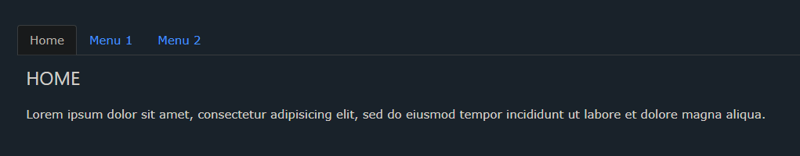

    ```html
    <!-- Nav tabs -->
    <ul class="nav nav-tabs">
        <li class="nav-item">
            <a class="nav-link active" data-bs-toggle="tab" href="#home">Home</a>
        </li>
        <li class="nav-item">
            <a class="nav-link" data-bs-toggle="tab" href="#menu1">Menu 1</a>
        </li>
        <li class="nav-item">
            <a class="nav-link" data-bs-toggle="tab" href="#menu2">Menu 2</a>
        </li>
    </ul>

    <!-- Tab panes -->
    <div class="tab-content">
        <div class="tab-pane container active" id="home">...</div>
        <div class="tab-pane container fade" id="menu1">...</div>
        <div class="tab-pane container fade" id="menu2">...</div>
    </div>
    ```

    [Try It Yourself](https://www.w3schools.com/bootstrap5/tryit.asp?filename=trybs_nav_tabs_toggleable&stacked=h)

## Toggleable / Dynamic Pills

- The same code applies to pills; only change the data-toggle attribute to data-toggle="pill":

    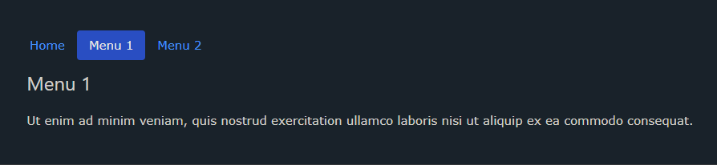

    ```html
    <!-- Nav pills -->
    <ul class="nav nav-pills">
        <li class="nav-item">
            <a class="nav-link active" data-bs-toggle="pill" href="#home">Home</a>
        </li>
        <li class="nav-item">
            <a class="nav-link" data-bs-toggle="pill" href="#menu1">Menu 1</a>
        </li>
        <li class="nav-item">
            <a class="nav-link" data-bs-toggle="pill" href="#menu2">Menu 2</a>
        </li>
    </ul>

    <!-- Tab panes -->
    <div class="tab-content">
        <div class="tab-pane container active" id="home">...</div>
        <div class="tab-pane container fade" id="menu1">...</div>
        <div class="tab-pane container fade" id="menu2">...</div>
    </div>
    ```

    [Try It Yourself](https://www.w3schools.com/bootstrap5/tryit.asp?filename=trybs_nav_pills_toggleable&stacked=h)

</details>

# Bootstrap 5 Navbars

<details>
  <summary>click to expand</summary>

## Navigation Bars

- A navigation bar is a navigation header that is placed at the top of the page:

    

## Basic Navbar

- With Bootstrap, a navigation bar can extend or collapse, depending on the screen size.

- A standard navigation bar is created with the `.navbar` class, followed by a responsive collapsing class: ``.navbar`-expand-xxl|xl|lg|md|sm` (stacks the navbar vertically on xxlarge, extra large, large, medium or small screens).

- To add links inside the navbar, use either an `<ul>` element (or a `<div>`) with `class="navbar-nav"`. Then add `<li>` elements with a `.nav-item` class followed by an `<a>` element with a `.nav-link` class:

    ```html
    <!-- A grey horizontal navbar that becomes vertical on small screens -->
    <nav class="navbar navbar-expand-sm bg-light">
        <div class="container-fluid">
            <!-- Links -->
            <ul class="navbar-nav">
                <li class="nav-item">
                    <a class="nav-link" href="#">Link 1</a>
                </li>
                <li class="nav-item">
                    <a class="nav-link" href="#">Link 2</a>
                </li>
                <li class="nav-item">
                    <a class="nav-link" href="#">Link 3</a>
                </li>
            </ul>
        </div>
    </nav>
    ```

    [Try It Yourself](https://www.w3schools.com/bootstrap5/tryit.asp?filename=trybs_navbar&stacked=h)

## Vertical Navbar

- **Remove** the `.navbar-expand-*` class to create a navigation bar that will always be vertical:

    ```html
    <!-- A grey vertical navbar -->
    <nav class="navbar bg-light">
        ...
    </nav>
    ```

    [Try It Yourself](https://www.w3schools.com/bootstrap5/tryit.asp?filename=trybs_navbar_vertical&stacked=h)

## Centered Navbar

- Add the `.justify-content-center` class to center the navigation bar:

    ```html
    <nav class="navbar navbar-expand-sm bg-light justify-content-center">
        ...
    </nav>
    ```

    [Try It Yourself](https://www.w3schools.com/bootstrap5/tryit.asp?filename=trybs_navbar_centered&stacked=h)

## Colored Navbar

- Use any of the `.bg-color` classes to change the background color of the navbar (`.bg-primary`, `.bg-success`, `.bg-info`, `.bg-warning`, `.bg-danger`, `.bg-secondary`, `.bg-dark` and `.bg-light`)

- Tip: Add a white text color to all links in the navbar with the `.navbar-dark` class, or use the `.navbar-light` class to add a black text color.

    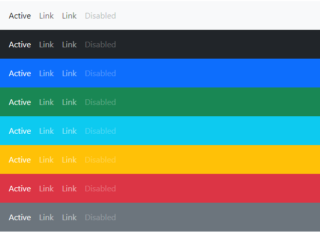

    ```html
    <!-- Grey with black text -->
    <nav class="navbar navbar-expand-sm bg-light navbar-light">
        <div class="container-fluid">
            <ul class="navbar-nav">
                <li class="nav-item">
                    <a class="nav-link active" href="#">Active</a>
                </li>
                <li class="nav-item">
                    <a class="nav-link" href="#">Link</a>
                </li>
                <li class="nav-item">
                    <a class="nav-link" href="#">Link</a>
                </li>
                <li class="nav-item">
                    <a class="nav-link disabled" href="#">Disabled</a>
                </li>
            </ul>
        </div>
    </nav>

    <!-- Black background with white text -->
    <nav class="navbar navbar-expand-sm bg-dark navbar-dark">...</nav>

    <!-- Blue background with white text -->
    <nav class="navbar navbar-expand-sm bg-primary navbar-dark">...</nav>
    ```

    [Try It Yourself](https://www.w3schools.com/bootstrap5/tryit.asp?filename=trybs_navbar_color&stacked=h)

- Active/disabled state: Add the `.active` class to an `<a>` element to highlight the current link, or the `.disabled` class to indicate that the link is un-clickable.

## Brand / Logo

- The `.navbar-brand` class is used to highlight the brand/logo/project name of your page:

    ```html
    <nav class="navbar navbar-expand-sm bg-dark navbar-dark">
        <div class="container-fluid">
            <a class="navbar-brand" href="#">Logo</a>
        </div>
    </nav>
    ```

    [Try It Yourself](https://www.w3schools.com/bootstrap5/tryit.asp?filename=trybs_navbar_brand&stacked=h)

- When using the `.navbar-brand` class with images, Bootstrap 5 will automatically style the image to fit the navbar vertically.

    ```html
    <nav class="navbar navbar-expand-sm bg-dark navbar-dark">
        <div class="container-fluid">
            <a class="navbar-brand" href="#">
                 
            </a>
        </div>
    </nav>
    ```

    [Try It Yourself](https://www.w3schools.com/bootstrap5/tryit.asp?filename=trybs_navbar_brand2&stacked=h)

## Navbar Text

- Use the `.navbar-text` class to vertical align any elements inside the navbar that are not links (ensures proper padding and text color).

    ```html
    <nav class="navbar navbar-expand-sm bg-dark navbar-dark">
        <div class="container-fluid">
            <span class="navbar-text">Navbar text</span>
        </div>
    </nav>
    ```

    [Try It Yourself](https://www.w3schools.com/bootstrap5/tryit.asp?filename=trybs_navbar_text&stacked=h)

- Very often, especially on small screens, you want to hide the navigation links and replace them with a button that should reveal them when clicked on.

- To create a collapsible navigation bar, use a button with `class="navbar-toggler"`, `data-bs-toggle="collapse"` and `data-bs-target="#thetarget"`. Then wrap the navbar content (links, etc) inside a `<div>` element with `class="collapse navbar-collapse"`, followed by an id that matches the `data-bs-target` of the button: `thetarget`.

    ```html
    <nav class="navbar navbar-expand-sm bg-dark navbar-dark">
        <div class="container-fluid">
            <a class="navbar-brand" href="#">Logo</a>
            <button class="navbar-toggler" type="button" data-bs-toggle="collapse" data-bs-target="#collapsibleNavbar">
                <span class="navbar-toggler-icon"></span>
            </button>
            <div class="collapse navbar-collapse" id="collapsibleNavbar">
                <ul class="navbar-nav">
                    <li class="nav-item">
                        <a class="nav-link" href="#">Link</a>
                    </li>
                    <li class="nav-item">
                        <a class="nav-link" href="#">Link</a>
                    </li>
                    <li class="nav-item">
                        <a class="nav-link" href="#">Link</a>
                    </li>
                </ul>
            </div>
        </div>
    </nav>
    ```

    [Try It Yourself](https://www.w3schools.com/bootstrap5/tryit.asp?filename=trybs_navbar_collapse)

- **Tip**: You can also remove the `.navbar-expand-md` class to ALWAYS hide navbar links and display the toggler button.

## Navbar With Dropdown

- Navbars can also hold dropdown menus:

    ```html
    <li class="nav-item dropdown">
        <a class="nav-link dropdown-toggle" href="#" role="button" data-bs-toggle="dropdown">Dropdown</a>
        <ul class="dropdown-menu">
            <li><a class="dropdown-item" href="#">Link</a></li>
            <li><a class="dropdown-item" href="#">Another link</a></li>
            <li><a class="dropdown-item" href="#">A third link</a></li>
        </ul>
    </li>
    ```

    [Try It Yourself](https://www.w3schools.com/bootstrap5/tryit.asp?filename=trybs_navbar_dropdown&stacked=h)

## Navbar Forms and Buttons

- You can also include forms inside the navigation bar:

    ```html
    <nav class="navbar navbar-expand-sm navbar-dark bg-dark">
        <div class="container-fluid">
            <a class="navbar-brand" href="javascript:void(0)">Logo</a>
            <button class="navbar-toggler" type="button" data-bs-toggle="collapse" data-bs-target="#mynavbar">
                <span class="navbar-toggler-icon"></span>
            </button>
            <div class="collapse navbar-collapse" id="mynavbar">
                <ul class="navbar-nav me-auto">
                    <li class="nav-item">
                        <a class="nav-link" href="javascript:void(0)">Link</a>
                    </li>
                    <li class="nav-item">
                        <a class="nav-link" href="javascript:void(0)">Link</a>
                    </li>
                    <li class="nav-item">
                        <a class="nav-link" href="javascript:void(0)">Link</a>
                    </li>
                </ul>
                <form class="d-flex">
                    <input class="form-control me-2" type="text" placeholder="Search">
                    <button class="btn btn-primary" type="button">Search</button>
                </form>
            </div>
        </div>
    </nav>
    ```

    [Try It Yourself](https://www.w3schools.com/bootstrap5/tryit.asp?filename=trybs_navbar_form&stacked=h)

## Fixed Navigation Bar

- The navigation bar can also be fixed at the top or at the bottom of the page.

- A fixed navigation bar stays visible in a fixed position (top or bottom) independent of the page scroll.

- The `.fixed-top` class makes the navigation bar fixed at the top:

    ```html
    <nav class="navbar navbar-expand-sm bg-dark navbar-dark fixed-top">
        ...
    </nav>
    ```

    [Try It Yourself](https://www.w3schools.com/bootstrap5/tryit.asp?filename=trybs_navbar_fixed&stacked=h)

- Use the `.fixed-bottom` class to make the navbar stay at the bottom of the page:

    ```html
    <nav class="navbar navbar-expand-sm bg-dark navbar-dark fixed-bottom">
        ...
    </nav>
    ```

    [Try It Yourself](https://www.w3schools.com/bootstrap5/tryit.asp?filename=trybs_navbar_fixed_bottom&stacked=h)

- Use the `.sticky-top` class to make the navbar fixed/stay at the top of the page when you scroll past it. Note: This class does not work in IE11 and earlier (will treat it as `position:relative`).

    ```html
    <nav class="navbar navbar-expand-sm bg-dark navbar-dark sticky-top">
        ...
    </nav>
    ```

    [Try It Yourself](https://www.w3schools.com/bootstrap5/tryit.asp?filename=trybs_navbar_fixed_sticky&stacked=h)

</details>

# Bootstrap 5 Carousel

<details>
  <summary>click to expand</summary>

## Carousel / Slideshow

- The Carousel is a slideshow for cycling through elements:

    

## How To Create a Carousel

- The following example shows how to create a basic carousel with indicators and controls:

    ```html
    <!-- Carousel -->
    <div id="demo" class="carousel slide" data-bs-ride="carousel">
        <!-- Indicators/dots -->
        <div class="carousel-indicators">
            <button type="button" data-bs-target="#demo" data-bs-slide-to="0" class="active"></button>
            <button type="button" data-bs-target="#demo" data-bs-slide-to="1"></button>
            <button type="button" data-bs-target="#demo" data-bs-slide-to="2"></button>
        </div>
        <!-- The slideshow/carousel -->
        <div class="carousel-inner">
            <div class="carousel-item active">
                
            </div>
            <div class="carousel-item">
                
            </div>
            <div class="carousel-item">
                
            </div>
        </div>
        <!-- Left and right controls/icons -->
        <button class="carousel-control-prev" type="button" data-bs-target="#demo" data-bs-slide="prev">
            <span class="carousel-control-prev-icon"></span>
        </button>
        <button class="carousel-control-next" type="button" data-bs-target="#demo" data-bs-slide="next">
            <span class="carousel-control-next-icon"></span>
        </button>
    </div>
    ```

    [Try It Yourself](https://www.w3schools.com/bootstrap5/tryit.asp?filename=trybs_carousel)

- A description of what each class from the example above do:

    |Class|Description|
    |:---|---|
    |`.carousel`|Creates a carousel|
    |`.carousel-indicators`|Adds indicators for the carousel. These are the little dots at the bottom of each slide (which indicates how many slides there are in the carousel, and which slide the user are currently viewing)|
    |`.carousel-inner`|Adds slides to the carousel|
    |`.carousel-item`|Specifies the content of each slide|
    |`.carousel-control-prev`|Adds a left (previous) button to the carousel, which allows the user to go back between the slides|
    |`.carousel-control-next`|Adds a right (next) button to the carousel, which allows the user to go forward between the slides|
    |`.carousel-control-prev-icon`|Used together with .carousel-control-prev to create a "previous" button|
    |`.carousel-control-next-icon`|Used together with .carousel-control-next to create a "next" button|
    |`.slide`|Adds a CSS transition and animation effect when sliding from one item to the next. Remove this class if you do not want this effect|

## Add Captions to Slides

- Add elements inside `<div class="carousel-caption">` within each `<div class="carousel-item">` to create a caption for each slide:

    ```html
    <div class="carousel-item">
        
        <div class="carousel-caption">
            <h3>Los Angeles</h3>
            <p>We had such a great time in LA!</p>
        </div>
    </div>
    ```

    [Try It Yourself](https://www.w3schools.com/bootstrap5/tryit.asp?filename=trybs_carousel2)

</details>

# Bootstrap 5 Modal

<details>
  <summary>click to expand</summary>

## Modals

- The Modal component is a dialog box/popup window that is displayed on top of the current page:

    

## How To Create a Modal

- The following example shows how to create a basic modal:

    ```html
    <!-- Button to Open the Modal -->
    <button type="button" class="btn btn-primary" data-bs-toggle="modal" data-bs-target="#myModal">
        Open modal
    </button>

    <!-- The Modal -->
    <div class="modal" id="myModal">
        <div class="modal-dialog">
            <div class="modal-content">
                <!-- Modal Header -->
                <div class="modal-header">
                    <h4 class="modal-title">Modal Heading</h4>
                    <button type="button" class="btn-close" data-bs-dismiss="modal"></button>
                </div>
                <!-- Modal Body -->
                <div class="modal-body">
                    Modal body..
                </div>
                <!-- Modal Footer -->
                <div class="modal-footer">
                    <button type="button" class="btn btn-danger" data-bs-dismiss="modal">Close</button>
                </div>
            </div>
        </div>
    </div>
    ```

    [Try It Yourself](https://www.w3schools.com/bootstrap5/tryit.asp?filename=trybs_modal&stacked=h)

## Add animation

- Use the `.fade` class to add a fading effect when opening and closing the modal:

    ```html
    <!-- Fading modal -->
    <div class="modal fade"></div>
    <!-- Modal without animation -->
    <div class="modal"></div>
    ```

    [Try It Yourself](https://www.w3schools.com/bootstrap5/tryit.asp?filename=trybs_modal_fade&stacked=h)

## Modal Size

- Change the size of the modal by adding the `.modal-sm` class for small modals (max-width 300px), `.modal-lg` class for large modals  (max-width 800px), or `.modal-xl` for extra large modals  (max-width 1140px). Default is `500px` max-width.

- Add the size class to the `<div>` element with class `.modal-dialog`:

- Small Modal

    ```html
    <div class="modal-dialog modal-sm">
    ```

    [Try It Yourself](https://www.w3schools.com/bootstrap5/tryit.asp?filename=trybs_modal_sm&stacked=h)

- Large Modal

    ```html
    <div class="modal-dialog modal-lg">
    ```

    [Try It Yourself](https://www.w3schools.com/bootstrap5/tryit.asp?filename=trybs_modal_lg&stacked=h)

- Extra Large Modal

    ```html
    <div class="modal-dialog modal-xl">
    ```

    [Try It Yourself](https://www.w3schools.com/bootstrap5/tryit.asp?filename=trybs_modal_xl&stacked=h)

- By default, modals are `medium` in size (`500px` max-width).

## Fullscreen Modals

- If you want the modal to span the whole width and height of the page, use the `.modal-fullscreen` class:

    ```html
    <div class="modal-dialog modal-fullscreen">
    ```

    [Try It Yourself](https://www.w3schools.com/bootstrap5/tryit.asp?filename=trybs_modal_fullscreen&stacked=h)

## Responsive Fullscreen Modals

You can also control when the modal should be in fullscreen, with the .modal-fullscreen-*-* classes:

|Class|Description|Example|
|---|---|:---:|
|`.modal-fullscreen-sm-down`|Fullscreen below 576px|[Try It](https://www.w3schools.com/bootstrap5/tryit.asp?filename=trybs_modal_fullscreen_sm)|
|`.modal-fullscreen-md-down`|Fullscreen below 768px|[Try It](https://www.w3schools.com/bootstrap5/tryit.asp?filename=trybs_modal_fullscreen_md)|
|`.modal-fullscreen-lg-down`|Fullscreen below 992px|[Try It](https://www.w3schools.com/bootstrap5/tryit.asp?filename=trybs_modal_fullscreen_lg)|
|`.modal-fullscreen-xl-down`|Fullscreen below 1200px|[Try It](https://www.w3schools.com/bootstrap5/tryit.asp?filename=trybs_modal_fullscreen_xl&stacked=h)|
|`.modal-fullscreen-xxl-down`|Fullscreen below 1400px|[Try It](https://www.w3schools.com/bootstrap5/tryit.asp?filename=trybs_modal_fullscreen_xxl&stacked=h)|

## Centered Modal

- Center the modal vertically and horizontally within the page, with the `.modal-dialog-centered` class:

    ```html
    <div class="modal-dialog modal-dialog-centered">
    ```

    [Try It Yourself](https://www.w3schools.com/bootstrap5/tryit.asp?filename=trybs_modal_centered)

## Scrolling Modal

- When you have a lot of content inside the modal, a scrollbar is added to the page. See the examples below to understand it:

    ```html
    <div class="modal-dialog">
    ```

    [Try It Yourself](https://www.w3schools.com/bootstrap5/tryit.asp?filename=trybs_modal_scroll&stacked=h)

- However, it is possible to only scroll inside the modal, instead of the page itself, by adding .modal-dialog-scrollable to .modal-dialog:

    ```html
    <div class="modal-dialog modal-dialog-scrollable">
    ```

    [Try It Yourself](https://www.w3schools.com/bootstrap5/tryit.asp?filename=trybs_modal_scroll2&stacked=h)

</details>

# Bootstrap 5 Tooltip

<details>
  <summary>click to expand</summary>

## Tooltips

- The Tooltip component is small pop-up box that appears when the user moves the mouse pointer over an element:

    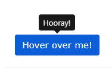

## How To Create a Tooltip

- To create a tooltip, add the `data-bs-toggle="tooltip"` attribute to an element.

- Use the `title` attribute to specify the text that should be displayed inside the tooltip:

    ```html
    <button type="button" class="btn btn-primary" data-bs-toggle="tooltip" title="Hooray!">Hover over me!</button>
    ```

- **Note**: Tooltips must be initialized with JavaScript to work.

- The following code will enable all tooltips in the document:

    ```html
    <script>
    var tooltipTriggerList = [].slice.call(document.querySelectorAll('[data-bs-toggle="tooltip"]'))
    var tooltipList = tooltipTriggerList.map(function (tooltipTriggerEl) {
        return new bootstrap.Tooltip(tooltipTriggerEl)
    })
    </script>
    ```

    [Try It Yourself](https://www.w3schools.com/bootstrap5/tryit.asp?filename=trybs_tooltip&stacked=h)

## Positioning Tooltips

- By default, the tooltip will appear on top of the element.

- Use the `data-bs-placement` attribute to set the position of the tooltip on top, bottom, left or the right side of the element:

    ```html
    <a href="#" data-bs-toggle="tooltip" data-bs-placement="top" title="Hooray!">Hover</a>
    <a href="#" data-bs-toggle="tooltip" data-bs-placement="bottom" title="Hooray!">Hover</a>
    <a href="#" data-bs-toggle="tooltip" data-bs-placement="left" title="Hooray!">Hover</a>
    <a href="#" data-bs-toggle="tooltip" data-bs-placement="right" title="Hooray!">Hover</a>
    ```

    [Try It Yourself](https://www.w3schools.com/bootstrap5/tryit.asp?filename=trybs_tooltip_pos&stacked=h)

</details>

# Bootstrap 5 Popover

<details>
  <summary>click to expand</summary>

## Popovers

- The Popover component is similar to tooltips; it is a pop-up box that appears when the user clicks on an element. The difference is that the popover can contain much more content.

    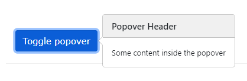

## How To Create a Popover

- To create a popover, add the `data-bs-toggle="popover"` attribute to an element.

- Use the `title` attribute to specify the header text of the popover, and use the `data-bs-content` attribute to specify the text that should be displayed inside the popover's body:

    ```html
    <button type="button" class="btn btn-primary" data-bs-toggle="popover" title="Popover Header" data-bs-content="Some content inside the popover">Toggle popover</button>
    ```

- **Note**: Popovers must be initialized with JavaScript to work.

- The following code will enable all popovers in the document:

    ```html
    <script>
    var popoverTriggerList = [].slice.call(document.querySelectorAll('[data-bs-toggle="popover"]'))
    var popoverList = popoverTriggerList.map(function (popoverTriggerEl) {
        return new bootstrap.Popover(popoverTriggerEl)
    })
    </script>
    ```

    [Try It Yourself](https://www.w3schools.com/bootstrap5/tryit.asp?filename=trybs_popover&stacked=h)

## Positioning Popovers

- By default, the popover will appear on the right side of the element.

- Use the `data-bs-placement` attribute to set the position of the popover on top, bottom, left or the right side of the element:

```html
<a href="#" title="Header" data-bs-toggle="popover" data-bs-placement="top" data-content="Content">Top</a>
<a href="#" title="Header" data-bs-toggle="popover" data-bs-placement="bottom" data-content="Content">Bottom</a>
<a href="#" title="Header" data-bs-toggle="popover" data-bs-placement="left" data-content="Content">Left</a>
<a href="#" title="Header" data-bs-toggle="popover" data-bs-placement="right" data-content="Content">Right</a>
```

[Try It Yourself](https://www.w3schools.com/bootstrap5/tryit.asp?filename=trybs_popover_pos&stacked=h)

- **Note**: The placement attributes do not work as you expect if it is not enough room for them. For example: if you use the top placement at the top of a page (where it is no room for it), it will instead display the popover below the element or to the right (wherever it is room for it).

## Closing Popovers

- By default, the popover is closed when you click on the element again. However, you can use the `data-bs-trigger="focus"` attribute which will close the popover when clicking outside the element:

    ```html
    <a href="#" title="Dismissible popover" data-bs-toggle="popover" data-bs-trigger="focus" data-bs-content="Click anywhere in the document to close this popover">Click me</a>
    ```

    [Try It Yourself](https://www.w3schools.com/bootstrap5/tryit.asp?filename=trybs_popover_focus&stacked=h)

## Hoverable Popover

- **Tip**: If you want the popover to be displayed when you move the mouse pointer over the element, use `the data-bs-trigger` attribute with a value of `"hover"`:

    ```html
    <a href="#" title="Header" data-bs-toggle="popover" data-bs-trigger="hover" data-bs-content="Popover text">Hover over me</a>
    ```

    [Try It Yourself](https://www.w3schools.com/bootstrap5/tryit.asp?filename=trybs_popover_hover&stacked=h)

</details>

# Bootstrap 5 Toasts

<details>
  <summary>click to expand</summary>

## Toasts

- The toast component is like an alert box that is only shown for a couple of seconds when something happens (i.e. when the user clicks on a button, submits a form, etc.).

## How To Create a Toast

- To create a toast, use the `.toast` class, and add a `.toast-header` and a `.toast-body` inside of it.

- **Note**: Toasts are hidden by default. Use the `.show` class if you want to display it. To close it, use a `<button>` element and add `data-bs-dismiss="toast"`:

    ```html
    <div class="toast show">
        <div class="toast-header">
            Toast Header
            <button type="button" class="btn-close" data-bs-dismiss="toast"></button>
        </div>
        <div class="toast-body">
            Some text inside the toast body
        </div>
    </div>
    ```

    [Try It Yourself](https://www.w3schools.com/bootstrap5/tryit.asp?filename=trybs_toast_close&stacked=h)

## Open a Toast

- To show a toast with a click of a button, you must initialize it with JavaScript: select the specified element and call the `toast()` method.

- The following code will show all `toasts` in the document when you click on a button:

    ```html
    <script>
    document.getElementById("toastbtn").onclick = function() {
        var toastElList = [].slice.call(document.querySelectorAll('.toast'))
        var toastList = toastElList.map(function(toastEl) {
            return new bootstrap.Toast(toastEl)
        })
        toastList.forEach(toast => toast.show())
    }
    </script>
    ```

    [Try It Yourself](https://www.w3schools.com/bootstrap5/tryit.asp?filename=trybs_toast&stacked=h)

</details>

# Bootstrap 5 Scrollspy

<details>
  <summary>click to expand</summary>

## Scrollspy

- Scrollspy is used to automatically update links in a navigation list based on scroll position.

    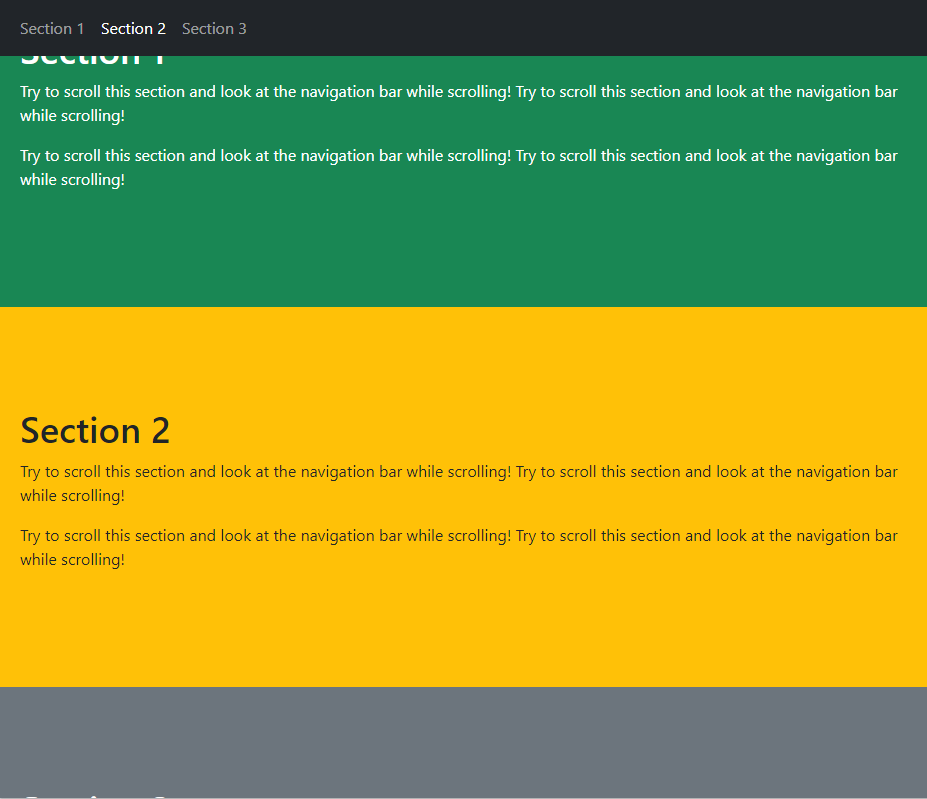

## How To Create a Scrollspy

- The following example shows how to create a scrollspy:

    ```html
    <!-- The scrollable area -->
    <body data-bs-spy="scroll" data-bs-target=".navbar" data-bs-offset="50">

    <!-- The navbar - The <a> elements are used to jump to a section in the scrollable area -->
    <nav class="navbar navbar-expand-sm bg-dark navbar-dark fixed-top">
    ...
        <ul class="navbar-nav">
            <li><a href="#section1">Section 1</a></li>
            ...
    </nav>

    <!-- Section 1 -->
    <div id="section1">
        <h1>Section 1</h1>
        <p>Try to scroll this page and look at the navigation bar while scrolling!</p>
    </div>
    ...

    </body>
    ```

    [Try It Yourself](https://www.w3schools.com/bootstrap5/tryit.asp?filename=trybs_scrollspy&stacked=h)

### Example Explained

- Add `data-bs-spy="scroll"` to the element that should be used as the scrollable area (often this is the `<body>` element).

- Then add the `data-bs-target` attribute with a value of the id or the class name of the navigation bar (`.navbar`). This is to make sure that the navbar is connected with the scrollable area.

- Note that scrollable elements must match the ID of the links inside the navbar's list items (`<div id="section1">` matches `<a href="#section1">`).

- The optional `data-bs-offset` attribute specifies the number of pixels to offset from top when calculating the position of scroll. This is useful when you feel that the links inside the navbar changes the active state too soon or too early when jumping to the scrollable elements. Default is 10 pixels.

- **Requires relative positioning**: The element with data-bs-spy="scroll" requires the CSS **position** property, with a value of "relative" to work properly.

</details>

# Bootstrap 5 Offcanvas

<details>
  <summary>click to expand</summary>

## Offcanvas

- Offcanvas is similar to modals (hidden by default and shown when activated), except that is often used as a sidebar navigation menu.

    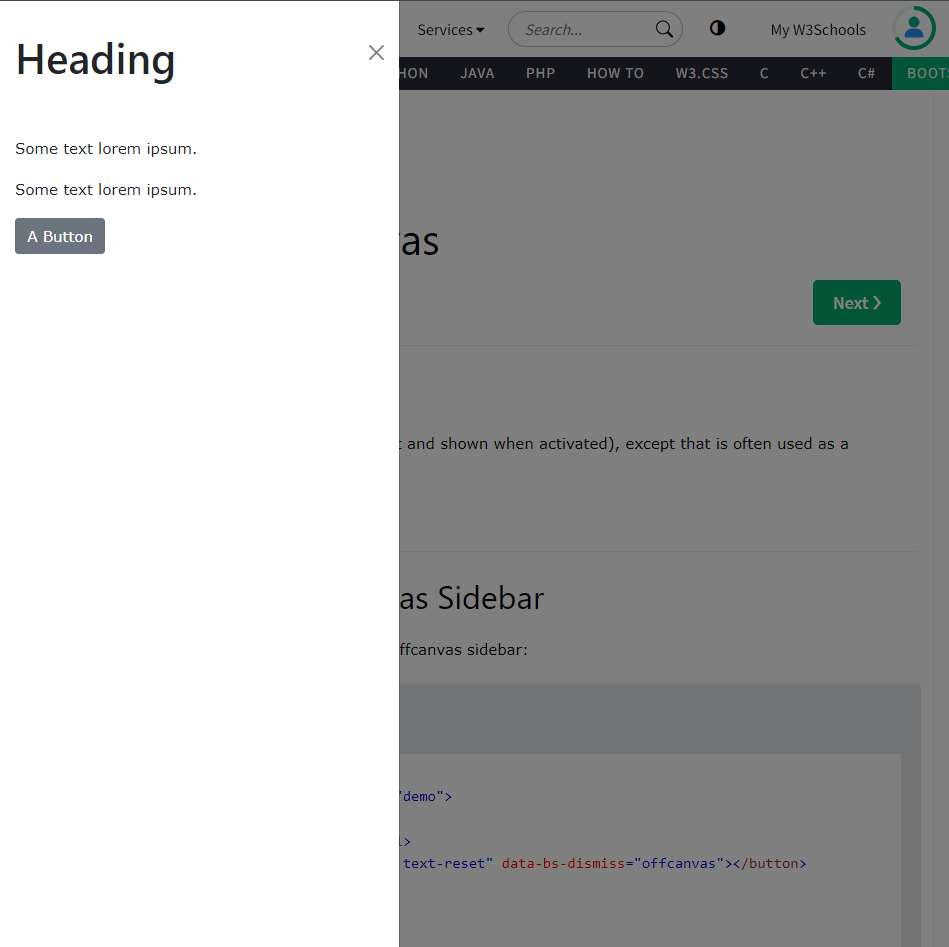

## How To Create an Offcanvas Sidebar

- The following example shows how to create an offcanvas sidebar:

    ```html
    <!-- Offcanvas Sidebar -->
    <div class="offcanvas offcanvas-start" id="demo">
        <div class="offcanvas-header">
            <h1 class="offcanvas-title">Heading</h1>
            <button type="button" class="btn-close text-reset" data-bs-dismiss="offcanvas"></button>
        </div>
        <div class="offcanvas-body">
            <p>Some text lorem ipsum.</p>
            <p>Some text lorem ipsum.</p>
            <button class="btn btn-secondary" type="button">A Button</button>
        </div>
    </div>

    <!-- Button to open the offcanvas sidebar -->
    <button class="btn btn-primary" type="button" data-bs-toggle="offcanvas" data-bs-target="#demo">
        Open Offcanvas Sidebar
    </button>
    ```

    [Try It Yourself](https://www.w3schools.com/bootstrap5/tryit.asp?filename=trybs_offcanvas&stacked=h)

### Example Explained

- The `.offcanvas` class creates the offcanvas sidebar.

- The `.offcanvas-start` class positions the offcanvas, and makes it 400px wide. See examples below for more positioning classes.

- The `.offcanvas-title` class ensures proper margins and line-height.

- Then, add your content inside the `.offcanvas-body` class.

- To open the offcanvas sidebar, you must use a `<button>` or an `<a>` element that points to the id of the `.offcanvas` container (`#demo` in our example).

- To open the offcanvas sidebar with an `<a>` element, you can point to `#demo` with the `href` attribute, instead of `data-bs-target` attribute.

## Offcanvas Position

- Use the `.offcanvas-start|end|top|bottom` to position the offcanvas to the left, right, top or bottom:

- Right Example

    ```html
    <div class="offcanvas offcanvas-end" id="demo">
    ```

    [Try It Yourself](https://www.w3schools.com/bootstrap5/tryit.asp?filename=trybs_offcanvas_end&stacked=h)

- Top Example

    ```html
    <div class="offcanvas offcanvas-top" id="demo">
    ```

    [Try It Yourself](https://www.w3schools.com/bootstrap5/tryit.asp?filename=trybs_offcanvas_top)

- Bottom Example

    ```html
    <div class="offcanvas offcanvas-bottom" id="demo">
    ```

    [Try It Yourself](https://www.w3schools.com/bootstrap5/tryit.asp?filename=trybs_offcanvas_bottom)

## Responsive OffCanvas Menu

- You can also control when you want to hide or show the offcanvas menu on different screen widths, with the `.offcanvas-sm|md|lg|xl|xxl` classes:

    ```html
    <div class="offcanvas offcanvas-start offcanvas-lg" id="demo">
    ```

    [Try It Yourself](https://www.w3schools.com/bootstrap5/tryit.asp?filename=trybs_offcanvas_responsive&stacked=h)

## Dark OffCanvas Menu

- Use the `.text-bg-dark` class to create a dark offcanvas menu.

- **Tip**: We have also added the `.btn-close-white` class to `.btn-close`, to create a white close button that looks nice with the dark background:

    ```html
    <div class="offcanvas offcanvas-start text-bg-dark" id="demo">
        <div class="offcanvas-header">
            <h1 class="offcanvas-title">Heading</h1>
            <button type="button" class="btn-close btn-close-white" data-bs-dismiss="offcanvas"></button>
        </div>
        <div class="offcanvas-body">
            <p>Some text lorem ipsum.</p>
            <p>Some text lorem ipsum.</p>
            <p>Some text lorem ipsum.</p>
            <button class="btn btn-secondary" type="button">A Button</button>
        </div>
    </div>
    ```

    [Try It Yourself](https://www.w3schools.com/bootstrap5/tryit.asp?filename=trybs_offcanvas_dark)

</details>

# Bootstrap 5 Utilities

<details>
  <summary>click to expand</summary>

## Utilities / Helper Classes

- Bootstrap 5 has a lot of utility/helper classes to quickly style elements without using any CSS code.

## Borders

- Use the `border` classes to add or remove borders from an element:

    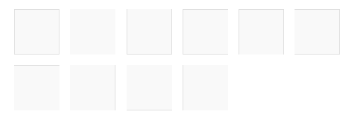

    ```html
    <span class="border"></span>
    <span class="border border-0"></span>
    <span class="border border-top-0"></span>
    <span class="border border-end-0"></span>
    <span class="border border-bottom-0"></span>
    <span class="border border-start-0"></span>
    <br>

    <span class="border-top"></span>
    <span class="border-end"></span>
    <span class="border-bottom"></span>
    <span class="border-start"></span>
    ```

    [Try It Yourself](https://www.w3schools.com/bootstrap5/tryit.asp?filename=trybs_util_borders&stacked=h)

## Border Width

- Use `.border-1` to `.border-5` to change the width of the border:

    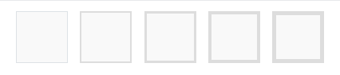

    ```html
    <span class="border border-1"></span>
    <span class="border border-2"></span>
    <span class="border border-3"></span>
    <span class="border border-4"></span>
    <span class="border border-5"></span>
    ```

    [Try It Yourself](https://www.w3schools.com/bootstrap5/tryit.asp?filename=trybs_util_borders_width&stacked=h)

## Border Color

- Add a color to the border with any of the contextual border color classes:

    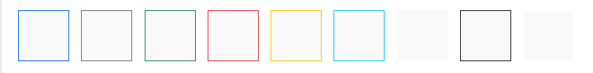

    ```html
    <span class="border border-primary"></span>
    <span class="border border-secondary"></span>
    <span class="border border-success"></span>
    <span class="border border-danger"></span>
    <span class="border border-warning"></span>
    <span class="border border-info"></span>
    <span class="border border-light"></span>
    <span class="border border-dark"></span>
    <span class="border border-white"></span>
    ```

    [Try It Yourself](https://www.w3schools.com/bootstrap5/tryit.asp?filename=trybs_util_borders_colors&stacked=h)

## Border Radius

- Add rounded corners to an element with the `rounded` classes:

    

    ```html
    <span class="rounded"></span>
    <span class="rounded-top"></span>
    <span class="rounded-end"></span>
    <span class="rounded-bottom"></span>
    <span class="rounded-start"></span>
    <span class="rounded-circle"></span>
    <span class="rounded-pill" style="width:130px"></span>
    <span class="rounded-0"></span>
    <span class="rounded-1"></span>
    <span class="rounded-2"></span>
    <span class="rounded-3"></span>
    <span class="rounded-4"></span>
    <span class="rounded-5"></span>
    ```

    [Try It Yourself](https://www.w3schools.com/bootstrap5/tryit.asp?filename=trybs_util_borders_rounded&stacked=h)

## Float and Clearfix

- Float an element to the right with the `.float-end` class or to the left with `.float-start`, and clear floats with the `.clearfix` class:

    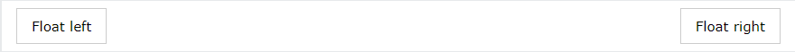

    ```html
    <div class="clearfix">
        <span class="float-start">Float left</span>
        <span class="float-end">Float right</span>
    </div>
    ```

    [Try It Yourself](https://www.w3schools.com/bootstrap5/tryit.asp?filename=trybs_util_float&stacked=h)

## Responsive Floats

- Float an element to the left or to the right depending on screen width, with the responsive float classes (`.float-*-start|end` - where* is `sm` (>=576px), `md` (>=768px), `lg` (>=992px), `xl` (>=1200px) or `xxl` (>=1400px)):

    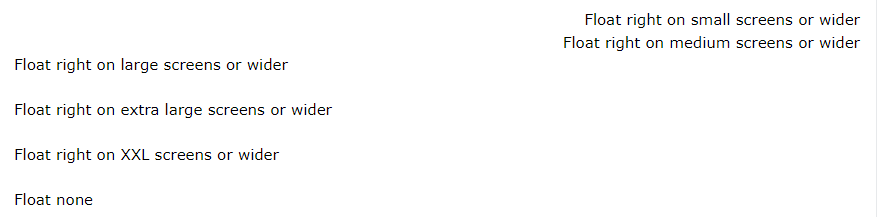

    ```html
    <div class="float-sm-end">Float right on small screens or wider</div><br>
    <div class="float-md-end">Float right on medium screens or wider</div><br>
    <div class="float-lg-end">Float right on large screens or wider</div><br>
    <div class="float-xl-end">Float right on extra large screens or wider</div><br>
    <div class="float-xxl-end">Float right on XXL screens or wider</div><br>
    <div class="float-none">Float none</div>
    ```

    [Try It Yourself](https://www.w3schools.com/bootstrap5/tryit.asp?filename=trybs_util_float_resp&stacked=h)

## Center Align

- Center an element with the `.mx-auto` class (adds margin-left and margin-right: auto):

    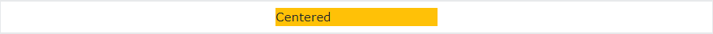

    ```html
    <div class="mx-auto bg-warning" style="width:150px">Centered</div>
    ```

    [Try It Yourself](https://www.w3schools.com/bootstrap5/tryit.asp?filename=trybs_util_center&stacked=h)

## Width

- Set the width of an element with the `w-*` classes (`.w-25`, `.w-50`, `.w-75`, `.w-100`, `.w-auto`, and `.mw-100`):

    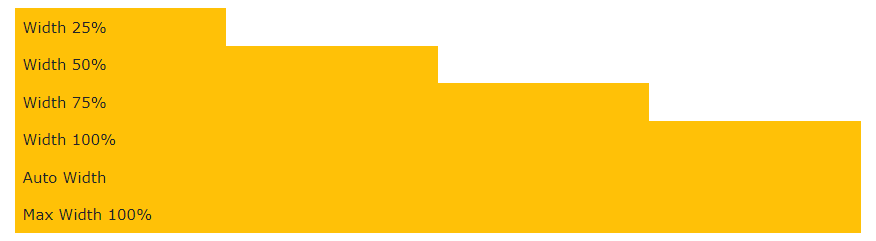

    ```html
    <div class="w-25 bg-warning">Width 25%</div>
    <div class="w-50 bg-warning">Width 50%</div>
    <div class="w-75 bg-warning">Width 75%</div>
    <div class="w-100 bg-warning">Width 100%</div>
    <div class="w-auto bg-warning">Auto Width</div>
    <div class="mw-100 bg-warning">Max Width 100%</div>
    ```

    [Try It Yourself](https://www.w3schools.com/bootstrap5/tryit.asp?filename=trybs_util_width&stacked=h)

## Height

- Set the height of an element with the `h-*` classes (`.h`-25, `.h-50`, `.h-75`, `.h-100`, `.h-auto`, and `.mh-100`):

    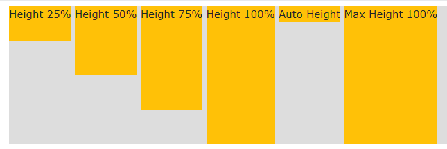

    ```html
    <div style="height:200px;background-color:#ddd">
        <div class="h-25 bg-warning">Height 25%</div>
        <div class="h-50 bg-warning">Height 50%</div>
        <div class="h-75 bg-warning">Height 75%</div>
        <div class="h-100 bg-warning">Height 100%</div>
        <div class="h-auto bg-warning">Auto Height</div>
        <div class="mh-100 bg-warning" style="height:500px">Max Height 100%</div>
    </div>
    ```

    [Try It Yourself](https://www.w3schools.com/bootstrap5/tryit.asp?filename=trybs_util_height&stacked=h)

## Spacing

- Bootstrap 5 has a wide range of responsive margin and padding utility classes. They work for all breakpoints: `xs` (<=576px), `sm` (>=576px), `md` (>=768px), `lg` (>=992px), `xl` (>=1200px) or `xxl` (>=1400px):

- The classes are used in the format: `{property}{sides}-{size}` for `xs` and `{property}{sides}-{breakpoint}-{size}` for `sm`, `md`, `lg`, `xl` and `xxl`.

- Where property is one of:

  - `m` - sets `margin`
  - `p` - sets `padding`

- Where *sides* is one of:

  - `t` - sets `margin-top` or `padding-top`
  - `b` - sets `margin-bottom` or `padding-bottom`
  - `s` - sets `margin-left` or `padding-left`
  - `e` - sets `margin-right` or `padding-right`
  - `x` - sets both `padding-left` and `padding-right` or `margin-left` and `margin-right`
  - `y` - sets both `padding-top` and `padding-bottom` or `margin-top` and `margin-bottom`
  - *blank* - sets a `margin` or `padding` on all 4 sides of the element

- Where size is one of:

  - `0` - sets `margin` or `padding` to `0`
  - `1` - sets `margin` or `padding` to `.25rem`
  - `2` - sets `margin` or `padding` to `.5rem`
  - `3` - sets `margin` or `padding` to `1rem`
  - `4` - sets `margin` or `padding` to `1.5rem`
  - `5` - sets `margin` or `padding` to `3rem`
  - `auto` - sets `margin` to `auto`

    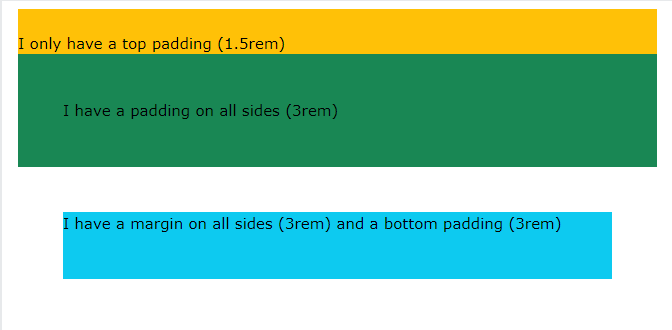

    ```html
    <div class="pt-4 bg-warning">I only have a top padding (1.5rem)</div>
    <div class="p-5 bg-success">I have a padding on all sides (3rem)</div>
    <div class="m-5 pb-5 bg-info">I have a margin on all sides (3rem) and a bottom padding (3rem)</div>
    ```

    [Try It Yourself](https://www.w3schools.com/bootstrap5/tryit.asp?filename=trybs_util_spacing&stacked=h)

### More Spacing Examples

- More Spacing Examples

    ||||
    |---|---|:---:|
    |`.m-# / m-*-#`|margin on all sides|[Try It](https://www.w3schools.com/bootstrap5/tryit.asp?filename=trybs_util_spacing&amp;stacked=h)|
    |`.mt-# / mt-*-#`|margin top|[Try It](https://www.w3schools.com/bootstrap5/tryit.asp?filename=trybs_util_mt-responsive&amp;stacked=h)|
    |`.mb-# / mb-*-#`|margin bottom|[Try It](https://www.w3schools.com/bootstrap5/tryit.asp?filename=trybs_util_mb-responsive&amp;stacked=h)|
    |`.ms-# / ms-*-#`|margin left|[Try It](https://www.w3schools.com/bootstrap5/tryit.asp?filename=trybs_util_ms-responsive&amp;stacked=h)|
    |`.me-# / me-*-#`|margin right|[Try It](https://www.w3schools.com/bootstrap5/tryit.asp?filename=trybs_util_me-responsive&amp;stacked=h)|
    |`.mx-# / mx-*-#`|margin left and right|[Try It](https://www.w3schools.com/bootstrap5/tryit.asp?filename=trybs_util_mx-responsive&amp;stacked=h)|
    |`.my-# / my-*-#`|margin top and bottom|[Try It](https://www.w3schools.com/bootstrap5/tryit.asp?filename=trybs_util_my-responsive&amp;stacked=h)|
    |`.p-# / p-*-#`|padding on all sides|[Try It](https://www.w3schools.com/bootstrap5/tryit.asp?filename=trybs_util_p-responsive&amp;stacked=h)|
    |`.pt-# / pt-*-#`|padding top|[Try It](https://www.w3schools.com/bootstrap5/tryit.asp?filename=trybs_util_pt-responsive&amp;stacked=h)|
    |`.pb-# / pb-*-#`|padding bottom|[Try It](https://www.w3schools.com/bootstrap5/tryit.asp?filename=trybs_util_pb-responsive&amp;stacked=h)|
    |`.ps-# / ps-*-#`|padding left|[Try It](https://www.w3schools.com/bootstrap5/tryit.asp?filename=trybs_util_ps-responsive&amp;stacked=h)|
    |`.pe-# / pe-*-#`|padding right|[Try It](https://www.w3schools.com/bootstrap5/tryit.asp?filename=trybs_util_pe-responsive&amp;stacked=h)|
    |`.py-# / py-*-#`|padding top and bottom|[Try It](https://www.w3schools.com/bootstrap5/tryit.asp?filename=trybs_util_py-responsive&amp;stacked=h)|
    |`.px-# / px-*-#`|padding left and righ|[Try It](https://www.w3schools.com/bootstrap5/tryit.asp?filename=trybs_util_px-responsive&amp;stacked=h)|

## Shadows

- Use the `shadow-` classes to add shadows to an element:

    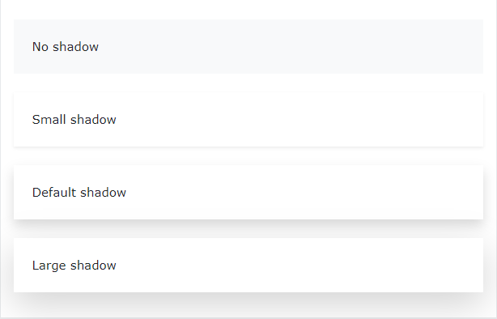

    ```html
    <div class="shadow-none p-4 mb-4 bg-light">No shadow</div>
    <div class="shadow-sm p-4 mb-4 bg-white">Small shadow</div>
    <div class="shadow p-4 mb-4 bg-white">Default shadow</div>
    <div class="shadow-lg p-4 mb-4 bg-white">Large shadow</div>
    ```

    [Try It Yourself](https://www.w3schools.com/bootstrap5/tryit.asp?filename=trybs_util_shadow&stacked=h)

## Vertical Align

- Use the `align-` classes to change the alignment of elements (only works on `inline`, `inline-block`, `inline-table` and table cell elements):

    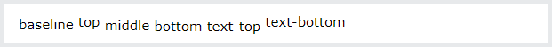

    ```html
    <span class="align-baseline">baseline</span>
    <span class="align-top">top</span>
    <span class="align-middle">middle</span>
    <span class="align-bottom">bottom</span>
    <span class="align-text-top">text-top</span>
    <span class="align-text-bottom">text-bottom</span>
    ```

    [Try It Yourself](https://www.w3schools.com/bootstrap5/tryit.asp?filename=trybs_util_align&stacked=h)

## Aspect Ratio

- Create responsive video or slideshows based on the width of the parent.

- Add the `.ratio` class together with an aspect ratio of your choice `.ratio-*` to a parent element, and add the embed (video or iframe) inside of it:

```html
<!-- Aspect ratio 1:1 -->
<div class="ratio ratio-1x1">
  <iframe src="https://www.youtube.com/embed/tgbNymZ7vqY"></iframe>
</div>

<!-- Aspect ratio 4:3 -->
<div class="ratio ratio-4x3">
  <iframe src="https://www.youtube.com/embed/tgbNymZ7vqY"></iframe>
</div>

<!-- Aspect ratio 16:9 -->
<div class="ratio ratio-16x9">
  <iframe src="https://www.youtube.com/embed/tgbNymZ7vqY"></iframe>
</div>

<!-- Aspect ratio 21:9 -->
<div class="ratio ratio-21x9">
  <iframe src="https://www.youtube.com/embed/tgbNymZ7vqY"></iframe>
</div>
```

[Try It Yourself](https://www.w3schools.com/bootstrap5/tryit.asp?filename=trybs_util_aspect_ratio)

## Visibility

- Use the `.visible` or `.invisible` classes to control the visibility of elements.
- **Note**: These classes do not change the CSS display value. They only add `visibility:visible` or `visibility:hidden`:

    ```html
    <div class="visible">I am visible</div>
    <div class="invisible">I am invisible</div>
    ```

    [Try It Yourself](https://www.w3schools.com/bootstrap5/tryit.asp?filename=trybs_util_visibility&stacked=h)

## Close icon

- Use the `.btn-close` class to style a close icon. This is often used for alerts and modals.

    ```html
    <button type="button" class="btn-close"></button>
    ```

    [Try It Yourself](https://www.w3schools.com/bootstrap5/tryit.asp?filename=trybs_util_close&stacked=h)

## Screenreaders

- Use the `.visually-hidden` class to hide an element on all devices, except screen readers:

    ```html
    <span class="visually-hidden">I will be hidden on all screens except for screen readers.</span>
    ```

    [Try It Yourself](https://www.w3schools.com/bootstrap5/tryit.asp?filename=trybs_util_sr&stacked=h)

## Colors

- As described in the Colors chapter, here is a list of all text and background color classes:

- The classes for text colors are: `.text-muted`, `.text-primary`, `.text-success`, `.text-info`, `.text-warning`, `.text-danger`, `.text-secondary`, `.text-white`, `.text-dark`, `.text-body` (default body color/often black) and `.text-light`:

- You can also add `50%` opacity for black or white text with the `.text-black-50` or `.text-white-50` classes:

    [Try It Yourself](https://www.w3schools.com/bootstrap5/tryit.asp?filename=trybs_txt_colors&stacked=h)

    [Try It Yourself](https://www.w3schools.com/bootstrap5/tryit.asp?filename=trybs_txt_colors_links&stacked=h)

    [Try It Yourself](https://www.w3schools.com/bootstrap5/tryit.asp?filename=trybs_txt_colors_opacity&stacked=h)

## Background Colors

- The classes for background colors are: `.bg-primary`, `.bg-success`, `.bg-info`, `.bg-warning`, `.bg-danger`, `.bg-secondary`, `.bg-dark` and `.bg-light`.

    [Try It Yourself](https://www.w3schools.com/bootstrap5/tryit.asp?filename=trybs_txt_bgcolors&stacked=h)

- The `.bg-color` classes above does not work well with text, or atleast then you have to specify a proper `.text-color` class to get the right text color for each background.

- However, you can use the `.text-bg-color` classes and Bootstrap will automatically handle the appropriate text color for each background color:

    [Try It Yourself](https://www.w3schools.com/bootstrap5/tryit.asp?filename=trybs_txt_bgcolors2&stacked=h)

</details>

<!--
# Bootstrap 5 Items

<details>
  <summary>click to expand</summary>

</details>
-->

# Bootstrap 5 Dark Mode

<details>
  <summary>click to expand</summary>

## Dark Mode

- By default, bootstrap pages have a white (light) background color.

- If you want to change the whole page to a darker color, you can add `data-bs-theme="dark"` to the `<html>` element:

    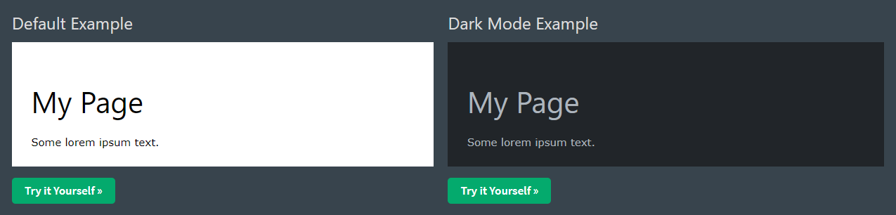

    ```html
    <html lang="en" data-bs-theme="dark">
        <head>
            ...
        </head>

        <body>
            ...
        </body>
    </html>
    ```

    [Try It Yourself](https://www.w3schools.com/bootstrap5/tryit.asp?filename=trybs_darkmode_light&stacked=h)
    [Try It Yourself](https://www.w3schools.com/bootstrap5/tryit.asp?filename=trybs_darkmode&stacked=h)

## Dark Mode For Components

- If you don't want the whole page to have a darker color, but only specific components, you can add the `data-bs-theme="dark"` attribute to the specified component.

- For example, add dark mode to a table:

    ```html
    <table class="table" data-bs-theme="dark">
    ```

    [Try It Yourself](https://www.w3schools.com/bootstrap5/tryit.asp?filename=trybs_darkmode_table&stacked=h)

- Or for example, add dark mode to a dropdown menu:

    ```html
    <div class="dropdown" data-bs-theme="dark">
    ```

    [Try It Yourself](https://www.w3schools.com/bootstrap5/tryit.asp?filename=trybs_darkmode_dropdown&stacked=h)

</details>

# Bootstrap 5 Flex

<details>
  <summary>click to expand</summary>

## Flexbox

- To create a flexbox container and to transform direct children into flex items, use the `d-flex` class:

    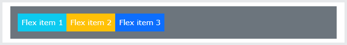

    ```html
    <div class="d-flex p-3 bg-secondary text-white">
        <div class="p-2 bg-info">Flex item 1</div>
        <div class="p-2 bg-warning">Flex item 2</div>
        <div class="p-2 bg-primary">Flex item 3</div>
    </div>
    ```

    [Try It Yourself](https://www.w3schools.com/bootstrap5/tryit.asp?filename=trybs_flex&stacked=h)

- To create an inline flexbox container, use the `d-inline-flex` class:

    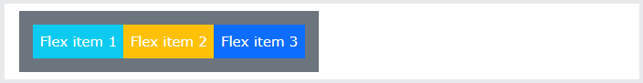

    ```html
    <div class="d-inline-flex p-3 bg-secondary text-white">
        <div class="p-2 bg-info">Flex item 1</div>
        <div class="p-2 bg-warning">Flex item 2</div>
        <div class="p-2 bg-primary">Flex item 3</div>
    </div>
    ```

    [Try It Yourself](https://www.w3schools.com/bootstrap5/tryit.asp?filename=trybs_flex-inline&stacked=h)

## Horizontal Direction

- Use `.flex-row` to display the flex items horizontally (side by side). This is default.

- **Tip**: Use `.flex-row-reverse` to right-align the horizontal direction:

    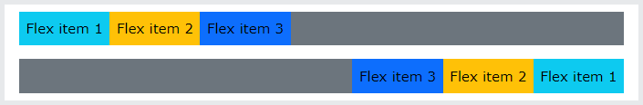

    ```html
    <div class="d-flex flex-row bg-secondary">
        <div class="p-2 bg-info">Flex item 1</div>
        <div class="p-2 bg-warning">Flex item 2</div>
        <div class="p-2 bg-primary">Flex item 3</div>
    </div>

    <div class="d-flex flex-row-reverse bg-secondary">
        <div class="p-2 bg-info">Flex item 1</div>
        <div class="p-2 bg-warning">Flex item 2</div>
        <div class="p-2 bg-primary">Flex item 3</div>
    </div>
    ```

    [Try It Yourself](https://www.w3schools.com/bootstrap5/tryit.asp?filename=trybs_flex-direction&stacked=h)

## Vertical Direction

- Use `.flex-column` to display the flex items vertically (on top of each other), or `.flex-column-reverse` to reverse the vertical direction:

    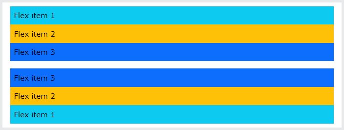

    ```html
    <div class="d-flex flex-column">
        <div class="p-2 bg-info">Flex item 1</div>
        <div class="p-2 bg-warning">Flex item 2</div>
        <div class="p-2 bg-primary">Flex item 3</div>
    </div>

    <div class="d-flex flex-column-reverse">
        <div class="p-2 bg-info">Flex item 1</div>
        <div class="p-2 bg-warning">Flex item 2</div>
        <div class="p-2 bg-primary">Flex item 3</div>
    </div>
    ```

    [Try It Yourself](https://www.w3schools.com/bootstrap5/tryit.asp?filename=trybs_flex-direction-col&stacked=h)

## Justify Content

- Use the `.justify-content-*` classes to change the alignment of flex items. Valid classes are `start` (default), `end`, `center`, `between` or `around`

    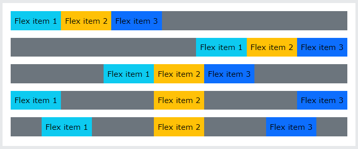

    ```html
    <div class="d-flex justify-content-start">...</div>
    <div class="d-flex justify-content-end">...</div>
    <div class="d-flex justify-content-center">...</div>
    <div class="d-flex justify-content-between">...</div>
    <div class="d-flex justify-content-around">...</div>
    ```

    [Try It Yourself](https://www.w3schools.com/bootstrap5/tryit.asp?filename=trybs_flex-justify&stacked=h)

## Fill / Equal Widths

- Use `.flex-fill` on flex items to force them into equal widths

    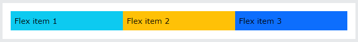

    ```html
    <div class="d-flex">
        <div class="p-2 bg-info flex-fill">Flex item 1</div>
        <div class="p-2 bg-warning flex-fill">Flex item 2</div>
        <div class="p-2 bg-primary flex-fill">Flex item 3</div>
    </div>
    ```

    [Try It Yourself](https://www.w3schools.com/bootstrap5/tryit.asp?filename=trybs_flex-fill&stacked=h)

## Grow

- Use `.flex-grow-1` on a flex item to take up the rest of the space. In the example below, the first two flex items take up their necessary space, while the last item takes up the rest of the available space

    

    ```html
    <div class="d-flex">
        <div class="p-2 bg-info">Flex item 1</div>
        <div class="p-2 bg-warning">Flex item 2</div>
        <div class="p-2 bg-primary flex-grow-1">Flex item 3</div>
    </div>
    ```

    [Try It Yourself](https://www.w3schools.com/bootstrap5/tryit.asp?filename=trybs_flex-grow&stacked=h)

## Order

- Change the visual order of a specific flex item(s) with the `.order` classes. Valid classes are from `0` to `5`, where the lowest number has highest priority (`order-1` is shown before `order-2`, etc..)

    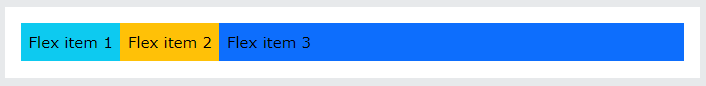

    ```html
    <div class="d-flex bg-secondary">
        <div class="p-2 bg-info order-3">Flex item 1</div>
        <div class="p-2 bg-warning order-2">Flex item 2</div>
        <div class="p-2 bg-primary order-1">Flex item 3</div>
    </div>
    ```

    [Try It Yourself](https://www.w3schools.com/bootstrap5/tryit.asp?filename=trybs_flex-order&stacked=h)

## Auto Margins

- Easily add auto margins to flex items with `.ms-auto` (push items to the right), or by using `.me-auto` (push items to the left):

    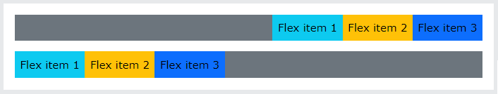

    ```html
    <div class="d-flex bg-secondary">
        <div class="p-2 ms-auto bg-info">Flex item 1</div>
        <div class="p-2 bg-warning">Flex item 2</div>
        <div class="p-2 bg-primary">Flex item 3</div>
    </div>

    <div class="d-flex bg-secondary">
        <div class="p-2 bg-info">Flex item 1</div>
        <div class="p-2 bg-warning">Flex item 2</div>
        <div class="p-2 me-auto bg-primary">Flex item 3</div>
    </div>
    ```

    [Try It Yourself](https://www.w3schools.com/bootstrap5/tryit.asp?filename=trybs_flex-auto-margins&stacked=h)

## Wrap

- Control how flex items wrap in a flex container with `.flex-nowrap` (default), `.flex-wrap` or `.flex-wrap-reverse`.

    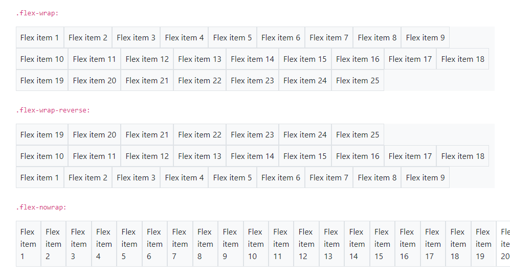

    ```html
    <div class="d-flex flex-wrap">..</div>

    <div class="d-flex flex-wrap-reverse">..</div>

    <div class="d-flex flex-nowrap">..</div>
    ```

    [Try It Yourself](https://www.w3schools.com/bootstrap5/tryit.asp?filename=trybs_flex-wrap&stacked=h)

## Align Content

- Control the vertical alignment of gathered flex items with the `.align-content-*` classes. Valid classes are `.align-content-start` (default), `.align-content-end`, `.align-content-center`, `.align-content-between`, `.align-content-around` and `.align-content-stretch`.

- **Note**: These classes have no effect on single rows of flex items.

    ```html
    <div class="d-flex flex-wrap align-content-start">..</div>

    <div class="d-flex flex-wrap align-content-end">..</div>

    <div class="d-flex flex-wrap align-content-center">..</div>

    <div class="d-flex flex-wrap align-content-around">..</div>

    <div class="d-flex flex-wrap align-content-stretch">..</div>
    ```

    [Try It Yourself](https://www.w3schools.com/bootstrap5/tryit.asp?filename=trybs_flex-align-content&stacked=h)

    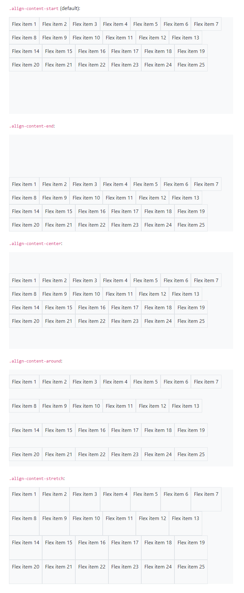

## Align Items

- Control the vertical alignment of single rows of flex items with the `.align-items-*` classes. Valid classes are `.align-items-start`, `.align-items-end`, `.align-items-center`, `.align-items-baseline`, and `.align-items-stretch` (default).

    ```html
    <div class="d-flex align-items-start">..</div>

    <div class="d-flex align-items-end">..</div>

    <div class="d-flex align-items-center">..</div>

    <div class="d-flex align-items-baseline">..</div>

    <div class="d-flex align-items-stretch">..</div>
    ```

    [Try It Yourself](https://www.w3schools.com/bootstrap5/tryit.asp?filename=trybs_flex-align-items&stacked=h)

## Align Self

- Control the vertical alignment of a specified flex item with the `.align-self-*` classes. Valid classes are `.align-self-start`, `.align-self-end`, `.align-self-center`, `.align-self-baseline`, and `.align-self-stretch` (default).

```html
<div class="d-flex bg-light" style="height:150px">
    <div class="p-2 border">Flex item 1</div>
    <div class="p-2 border align-self-start">Flex item 2</div>
    <div class="p-2 border">Flex item 3</div>
</div>
```

[Try It Yourself](https://www.w3schools.com/bootstrap5/tryit.asp?filename=trybs_flex-align-self&stacked=h)

## Responsive Flex Classes

- All flex classes comes with additional responsive classes, which makes it easy to set a specific flex class on a specific screen size.

- The `*` symbol can be replaced with `sm`, `md`, `lg`, `xl` or `xxl`, which represents small, medium, large, xlarge and xxlarge screens.

|Class|Description|Example|
|---|---|---|
|**Flex Container**|||
|`.d-*-flex`|Creates a flexbox container for different screens|[Try It](https://www.w3schools.com/bootstrap5/tryit.asp?filename=trybs_flex-responsive)|
|`.d-*-inline-flex`|Creates an inline flexbox container for different screens|[Try It](https://www.w3schools.com/bootstrap5/tryit.asp?filename=trybs_flex-inline-responsive)|
|**Direction**|||
|`.flex-*-row`|Display flex items horizontally on different screens|[Try It](https://www.w3schools.com/bootstrap5/tryit.asp?filename=trybs_flex-row-responsive)|
|`.flex-*-row-reverse`|Display flex items horizontally, and right-aligned, on different screens|[Try It](https://www.w3schools.com/bootstrap5/tryit.asp?filename=trybs_flex-row-reverse-responsive)|
|`.flex-*-column`|Display flex items vertically on different screens|[Try It](https://www.w3schools.com/bootstrap5/tryit.asp?filename=trybs_flex-column-responsive)|
|`.flex-*-column-reverse`|Display flex items vertically, with reversed order, on different screens screens|[Try It](https://www.w3schools.com/bootstrap5/tryit.asp?filename=trybs_flex-column-reverse-responsive)|
|**Justified Content**|||
|`.justify-content-*-start`|Display flex items from the start (left-aligned) on different screens|[Try It](https://www.w3schools.com/bootstrap5/tryit.asp?filename=trybs_flex-justify-start-responsive)|
|`.justify-content-*-end`|Display flex items at the end (right-aligned) on different screens|[Try It](https://www.w3schools.com/bootstrap5/tryit.asp?filename=trybs_flex-justify-end-responsive)|
|`.justify-content-*-center`|Display flex items in the center of a flex container on different screens|[Try It](https://www.w3schools.com/bootstrap5/tryit.asp?filename=trybs_flex-justify-center-responsive)|
|`.justify-content-*-between`|Display flex items in "between" on different screens|[Try It](https://www.w3schools.com/bootstrap5/tryit.asp?filename=trybs_flex-justify-between-responsive)|
|`.justify-content-*-around`|Display flex items "around" on different screens|[Try It](https://www.w3schools.com/bootstrap5/tryit.asp?filename=trybs_flex-justify-around-responsive)|
|**Fill / Equal Width**|||
|`.flex-*-fill`|Force flex items into equal widths on different screens|[Try It](https://www.w3schools.com/bootstrap5/tryit.asp?filename=trybs_flex-fill-responsive)|
|**Grow**|||
|`.flex-*-grow-0`|Don't make the items grow on different screens||
|`.flex-*-grow-1`|Make items grow on different screens||
|**Shrink**|||
|`.flex-*-shrink-0`|Don't make the items shrink on diferent screens||
|`.flex-*-shrink-1`|Make items shrink on different screens||
|**Order**|||
|`.order-*-0-12`|Change the order from 0 to 5 on small screens|[Try It](https://www.w3schools.com/bootstrap5/tryit.asp?filename=trybs_flex-order-responsive)|
|**Wrap**|||
|`.flex-*-nowrap`|Don't wrap items on different screens|[Try It](https://www.w3schools.com/bootstrap5/tryit.asp?filename=trybs_flex-nowrap-responsive)|
|`.flex-*-wrap`|Wrap items on different screens|[Try It](https://www.w3schools.com/bootstrap5/tryit.asp?filename=trybs_flex-wrap-responsive)|
|`.flex-*-wrap-reverse`|Reverse the wrapping of items on different screens|[Try It](https://www.w3schools.com/bootstrap5/tryit.asp?filename=trybs_flex-wrap-reverse-responsive)|
|**Align Content**|||
|`.align-content-*-start`|Align gathered items from the start on different screens|[Try It](https://www.w3schools.com/bootstrap5/tryit.asp?filename=trybs_flex-align-content-start-responsive)|
|`.align-content-*-end`|Align gathered items at the end on different screens|[Try It](https://www.w3schools.com/bootstrap5/tryit.asp?filename=trybs_flex-align-content-end-responsive)|
|`.align-content-*-center`|Align gathered items in the center on different screens|[Try It](https://www.w3schools.com/bootstrap5/tryit.asp?filename=trybs_flex-align-content-center-responsive)|
|`.align-content-*-around`|Align gathered items "around" on different screens|[Try It](https://www.w3schools.com/bootstrap5/tryit.asp?filename=trybs_flex-align-content-around-responsive)|
|`.align-content-*-stretch`|Stretch gathered items on different screens|[Try It](https://www.w3schools.com/bootstrap5/tryit.asp?filename=trybs_flex-align-content-stretch-responsive)|
|**Align Items**|||
|`.align-items-*-start`|Align single rows of items from the start on different screens|[Try It](https://www.w3schools.com/bootstrap5/tryit.asp?filename=trybs_flex-align-items-start-responsive)|
|`.align-items-*-end`|Align single rows of items at the end on different screens|[Try It](https://www.w3schools.com/bootstrap5/tryit.asp?filename=trybs_flex-align-items-end-responsive)|
|`.align-items-*-center`|Align single rows of items in the center on different screens|[Try It](https://www.w3schools.com/bootstrap5/tryit.asp?filename=trybs_flex-align-items-center-responsive)|
|`.align-items-*-baseline`|Align single rows of items on the baseline on different screens|[Try It](https://www.w3schools.com/bootstrap5/tryit.asp?filename=trybs_flex-align-items-baseline-responsive)|
|`.align-items-*-stretch`|Stretch single rows of items on different screens|[Try It](https://www.w3schools.com/bootstrap5/tryit.asp?filename=trybs_flex-align-items-stretch-responsive)|
|**Align Self**|||
|`.align-self-*-start`|Align a flex item from the start on different screens|[Try It](https://www.w3schools.com/bootstrap5/tryit.asp?filename=trybs_flex-align-self-start-responsive)|
|`.align-self-*-end`|Align a flex item at the end on different screens|[Try It](https://www.w3schools.com/bootstrap5/tryit.asp?filename=trybs_flex-align-self-end-responsive)|
|`.align-self-*-center`|Align a flex item in the center on different screens|[Try It](https://www.w3schools.com/bootstrap5/tryit.asp?filename=trybs_flex-align-self-center-responsive)|
|`.align-self-*-baseline`|Align a flex item on the baseline on different screens|[Try It](https://www.w3schools.com/bootstrap5/tryit.asp?filename=trybs_flex-align-self-baseline-responsive)|
|`.align-self-*-stretch`|Stretch a flex item on different screens|[Try It](https://www.w3schools.com/bootstrap5/tryit.asp?filename=trybs_flex-align-self-stretch-responsive)|

</details>

<!--
# Bootstrap 5 Items

<details>
  <summary>click to expand</summary>

</details>
-->
