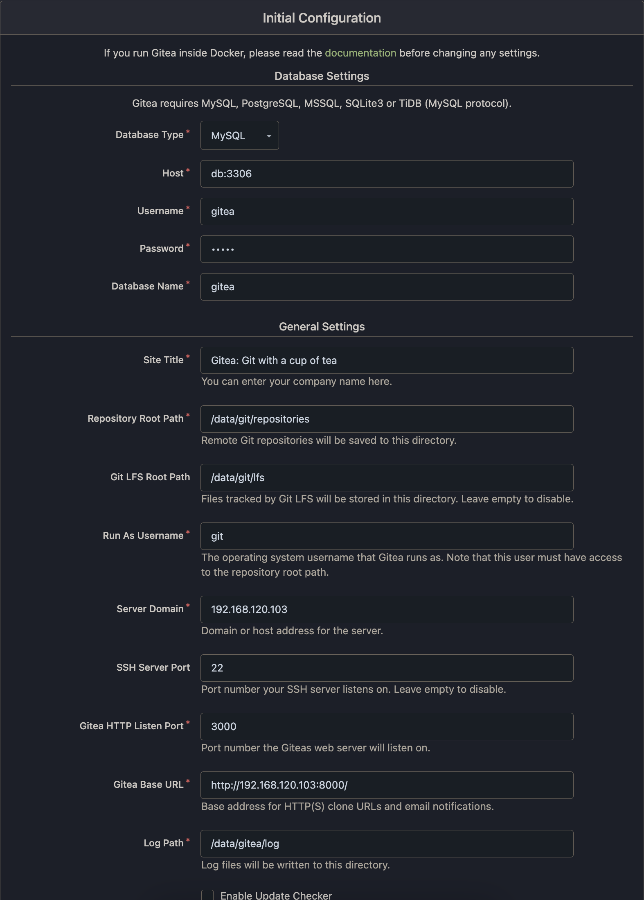
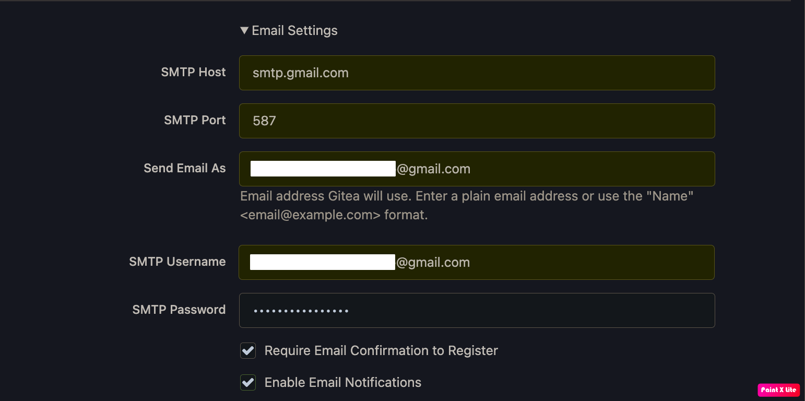
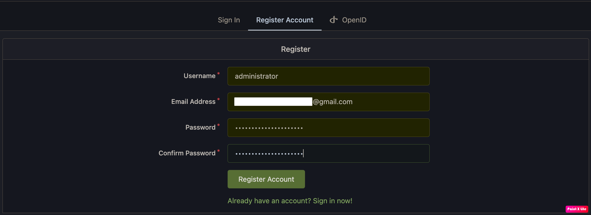

# Gitea

## Installation

### Basics

- The most simple setup just creates a volume and a network and starts the `gitea/gitea:latest` image as a service. Since there is no database available, one can be initialized using `SQLite3`. 
- Create a directory like gitea and paste the following content into a file named `docker-compose-gitea.yml`.

<details>
  <summary>docker-compose-gitea.yml</summary>

```yml
version: "3"

networks:
  gitea:
    external: false

services:
  server:
    image: gitea/gitea:1.21.0
    container_name: gitea
    environment:
      - USER_UID=1000
      - USER_GID=1000
    restart: always
    networks:
      - gitea
    volumes:
      - ./gitea:/data
      - /etc/timezone:/etc/timezone:ro
      - /etc/localtime:/etc/localtime:ro
    ports:
      - "3000:3000"
      - "222:22"
```
</details>

### Ports

- To bind the integrated OpenSSH daemon and the webserver on a different port, adjust the port section. It's common to just change the host port and keep the ports within the container like they are.

<details>
  <summary>docker-compose-gitea.yml</summary>

```diff
version: "3"

networks:
  gitea:
    external: false

services:
  server:
    image: gitea/gitea:1.21.0
    container_name: gitea
    environment:
      - USER_UID=1000
      - USER_GID=1000
    restart: always
    networks:
      - gitea
    volumes:
      - ./gitea:/data
      - /etc/timezone:/etc/timezone:ro
      - /etc/localtime:/etc/localtime:ro
    ports:
-     - "3000:3000"
-     - "222:22"
+     - "8080:3000"
+     - "2221:22"
```
</details>

### Databases

#### MySQL database

- To start Gitea in combination with a `MySQL` database, apply these changes to the `docker-compose-gitea.yml` file created above.

<details>
  <summary>docker-compose-gitea.yml</summary>

```diff
version: "3"

networks:
  gitea:
    external: false

services:
  server:
    image: gitea/gitea:1.21.0
    container_name: gitea
    environment:
      - USER_UID=1000
      - USER_GID=1000
+      - GITEA__database__DB_TYPE=mysql
+      - GITEA__database__HOST=db:3306
+      - GITEA__database__NAME=gitea
+      - GITEA__database__USER=gitea
+      - GITEA__database__PASSWD=gitea
    restart: always
    networks:
      - gitea
    volumes:
      - ./gitea:/data
      - /etc/timezone:/etc/timezone:ro
      - /etc/localtime:/etc/localtime:ro
    ports:
      - "3000:3000"
      - "222:22"
+    depends_on:
+      - db
+
+  db:
+    image: mysql:8
+    restart: always
+    environment:
+      - MYSQL_ROOT_PASSWORD=gitea
+      - MYSQL_USER=gitea
+      - MYSQL_PASSWORD=gitea
+      - MYSQL_DATABASE=gitea
+    networks:
+      - gitea
+    volumes:
+      - ./mysql:/var/lib/mysql
```
</details>

#### PostgreSQL database

- To start Gitea in combination with a PostgreSQL database, apply these changes to the `docker-compose-gitea.yml` file created above.

<details>
  <summary>docker-compose-gitea.yml</summary>

```diff
version: "3"

networks:
  gitea:
    external: false

services:
  server:
    image: gitea/gitea:1.21.0
    container_name: gitea
    environment:
      - USER_UID=1000
      - USER_GID=1000
+      - GITEA__database__DB_TYPE=postgres
+      - GITEA__database__HOST=db:5432
+      - GITEA__database__NAME=gitea
+      - GITEA__database__USER=gitea
+      - GITEA__database__PASSWD=gitea
    restart: always
    networks:
      - gitea
    volumes:
      - ./gitea:/data
      - /etc/timezone:/etc/timezone:ro
      - /etc/localtime:/etc/localtime:ro
    ports:
      - "3000:3000"
      - "222:22"
+    depends_on:
+      - db
+
+  db:
+    image: postgres:14
+    restart: always
+    environment:
+      - POSTGRES_USER=gitea
+      - POSTGRES_PASSWORD=gitea
+      - POSTGRES_DB=gitea
+    networks:
+      - gitea
+    volumes:
+      - ./postgres:/var/lib/postgresql/data
```
</details>

### Named volumes

- To use named volumes instead of host volumes, define and use the named volume within the `docker-compose-gitea.yml` configuration. This change will automatically create the required volume. You don't need to worry about permissions with named volumes; Docker will deal with that automatically.

<details>
  <summary>docker-compose-gitea.yml</summary>

```diff
version: "3"

networks:
  gitea:
    external: false

+volumes:
+  gitea:
+    driver: local
+
services:
  server:
    image: gitea/gitea:1.21.0
    container_name: gitea
-    environment:
-      - USER_UID=1000
-      - USER_GID=1000
    restart: always
    networks:
      - gitea
    volumes:
-      - ./gitea:/data
+      - gitea:/data
      - /etc/timezone:/etc/timezone:ro
      - /etc/localtime:/etc/localtime:ro
    ports:
      - "3000:3000"
      - "222:22"
```
</details>

### Startup

- To start this setup based on `docker-compose`

    - Execute `docker-compose -f docker-compose-gitea.yml up -d `, to launch Gitea in the background.
    - Using `docker-compose ps` will show if Gitea started properly.
    - Logs can be viewed with `docker-compose logs`.

- To shut down the setup, execute `docker-compose down`. This will stop and kill the containers. The volumes will still exist.

- `docker-compose down` removes all container.

- `docker-compose down -v` removes all volumes attached.

- Notice: if using a non-3000 port on http, change `app.ini` to match `LOCAL_ROOT_URL = http://localhost:3000/`.

### `docker-compse-gitea.yml`

- On the host, create the `git` user which shares the same UID/ GID as the container values USER_UID/ USER_GID: `sudo useradd git [-g 1000]`

- Get `git` UID and GID: `id git`, and the output like this: `uid=1001(git) gid=1000(emoi) groups=1000(emoi)`

<details>
  <summary>docker-compose-gitea.yml</summary>

```yml
version: "3"

networks:
  gitea:
    external: false

volumes:
  data-volume:
    driver: local
  mysql-volume:
    driver: local
  postgres-volume:
    driver: local

services:
  server:
    image: gitea/gitea:1.21.2
    container_name: gitea
    environment:
      - USER_UID=1001
      - USER_GID=1000
      - GITEA__database__DB_TYPE=mysql
      - GITEA__database__HOST=db:3306
      - GITEA__database__NAME=gitea
      - GITEA__database__USER=gitea
      - GITEA__database__PASSWD=gitea
      # - GITEA__database__DB_TYPE=postgres
      # - GITEA__database__HOST=db:5432
      # - GITEA__database__NAME=gitea
      # - GITEA__database__USER=gitea
      # - GITEA__database__PASSWD=gitea
    restart: always
    networks:
      - gitea
    volumes:
      - data-volume:/data
      - /etc/timezone:/etc/timezone:ro
      - /etc/localtime:/etc/localtime:ro
    ports:
      - "8000:3000"
      - "2222:22"
    depends_on:
      - db

  db:
    image: mysql:8
    container_name: gitea_db
    restart: always
    environment:
      - MYSQL_ROOT_PASSWORD=gitea
      - MYSQL_USER=gitea
      - MYSQL_PASSWORD=gitea
      - MYSQL_DATABASE=gitea
    networks:
      - gitea
    volumes:
      - mysql-volume:/var/lib/mysql

  # db:
  #   image: postgres:14
  #   container_name: gitea_db
  #   restart: always
  #   environment:
  #     - POSTGRES_USER=gitea
  #     - POSTGRES_PASSWORD=gitea
  #     - POSTGRES_DB=gitea
  #   networks:
  #     - gitea
  #   volumes:
  #     - postgres-volume:/var/lib/postgresql/data

  backup:
    image: alpine
    tty: false
    environment:
      - TARGET=${TARGET}
    volumes:
      - data-volume:/data
      - mysql-volume:/mysql-data
      # - postgres-volume:/postgres-data
      - ./backup:/backup
    command: sh -c "cd /data && tar -czf /backup/gitea_data_$${TARGET}.tar.gz *; cd /mysql-data && tar -czf /backup/gitea_db_$${TARGET}.tar.gz *"

  restore:
    image: alpine
    environment:
      - TARGET=${TARGET}
    volumes:
      - data-volume:/data
      - mysql-volume:/mysql-data
      # - postgres-volume:/postgres-data
      - ./backup:/backup
    command: sh -c "rm -rf /data/* /data/..?* /data/.[!.]* /mysql-data/* /mysql-data/..?* /mysql-data/.[!.]*; tar -xzf /backup/gitea_data_$${TARGET}.tar.gz -C /data; tar -xzf /backup/gitea_db_$${TARGET}.tar.gz -C /mysql-data"
```
</details>

### Configure

- Access `127.0.0.1:8000` for initial configuration and email configuration.





- Then create first user, it will consider as administrator.



- And all accounts registered after will need to activate via link will sent to user's email


- You can modify the configuration after initially by `app.ini` file

```bash
docker exec -it gitea bash
vi /data/gitea/conf/app.ini
```

<details>
  <summary>app.ini</summary>

```
APP_NAME = Gitea: Git with a cup of tea
RUN_MODE = prod
RUN_USER = git
WORK_PATH = /data/gitea

[repository]
ROOT = /data/git/repositories

[repository.local]
LOCAL_COPY_PATH = /data/gitea/tmp/local-repo

[repository.upload]
TEMP_PATH = /data/gitea/uploads

[server]
APP_DATA_PATH = /data/gitea
DOMAIN = 127.0.0.1
SSH_DOMAIN = 127.0.0.1
HTTP_PORT = 3000
ROOT_URL = http://127.0.0.1:8000/
DISABLE_SSH = false
SSH_PORT = 22
SSH_LISTEN_PORT = 22
LFS_START_SERVER = true
LFS_JWT_SECRET = *******************************************
OFFLINE_MODE = false

[database]
PATH = /data/gitea/gitea.db
DB_TYPE = mysql
HOST = db:3306
NAME = gitea
USER = gitea
PASSWD = gitea
LOG_SQL = false
SCHEMA =
SSL_MODE = disable

[indexer]
ISSUE_INDEXER_PATH = /data/gitea/indexers/issues.bleve

[session]
PROVIDER_CONFIG = /data/gitea/sessions
PROVIDER = file

[picture]
AVATAR_UPLOAD_PATH = /data/gitea/avatars
REPOSITORY_AVATAR_UPLOAD_PATH = /data/gitea/repo-avatars

[attachment]
PATH = /data/gitea/attachments

[log]
MODE = console
LEVEL = info
ROOT_PATH = /data/gitea/log

[security]
INSTALL_LOCK = true
SECRET_KEY =
REVERSE_PROXY_LIMIT = 1
REVERSE_PROXY_TRUSTED_PROXIES = *
INTERNAL_TOKEN = *********************************************************************************************************
PASSWORD_HASH_ALGO = pbkdf2

[service]
DISABLE_REGISTRATION = false
REQUIRE_SIGNIN_VIEW = false
REGISTER_EMAIL_CONFIRM = false
ENABLE_NOTIFY_MAIL = true
ALLOW_ONLY_EXTERNAL_REGISTRATION = false
ENABLE_CAPTCHA = false
DEFAULT_KEEP_EMAIL_PRIVATE = false
DEFAULT_ALLOW_CREATE_ORGANIZATION = true
DEFAULT_ENABLE_TIMETRACKING = true
NO_REPLY_ADDRESS = noreply.localhost

[lfs]
PATH = /data/git/lfs

[mailer]
ENABLED = true
SMTP_ADDR = smtp.gmail.com
SMTP_PORT = 587
FROM = ***********************************
USER = ***********************************
PASSWD = ****************

[openid]
ENABLE_OPENID_SIGNIN = true
ENABLE_OPENID_SIGNUP = true

[cron.update_checker]
ENABLED = false

[repository.pull-request]
DEFAULT_MERGE_STYLE = merge

[repository.signing]
DEFAULT_TRUST_MODEL = committer

[oauth2]
JWT_SECRET = *******************************************
```

</details>

### SSH

- Remember add key as on github

- add remote repo: `git remote add gitea ssh://git@192.168.120.103:2222/datlt4/gst-learn.git`

### Control

- Use `gitea_tools.sh` to start, stop gitea server and also backup and restore gitea data.
  
  <details>
    <summary>gitea_tools.sh</summary>
  
  ```bash
  # !/usr/bin/env bash

  # XTERM Color
  case "$TERM" in xterm-color | *-256color) color_prompt=yes ;;
  esac

  # define function
  print_with_color() {
      local str="$1"
      local color="$2"
      if [ "$color_prompt" = yes ]; then
          printf "${color}${str}\033[0m"
      else
          printf "${str}"
      fi
  }

  exit_with_error_code() {
      local error_code=$1
      local message="$2"
      if [ ${error_code} -gt 0 ]; then
          print_with_color "$message" "\033[1m\033[31m"
          exit ${error_code}
      fi
  }

  # Define variable
  flag_BACKUP=0
  flag_find_BACKUP=0
  target_BACKUP="$(date +%Y%m%d_%H%M%S)"

  flag_RESTORE=0
  flag_find_RESTORE=0
  target_RESTORE=""

  flag_START_GITEA=1
  flag_STOP_GITEA=0

  flag_DELETE_RESOURCE=0
  flag_RESTART=0

  docker_compose_yml="docker-compose.yml"
  backup_dir="backup/"

  DEBUG=0
  N_BACKUP_KEEP=10

  # Parse input arguments
  while [[ "$#" -gt 0 ]]; do
      case $1 in
          -b | --backup | "-b " | "--backup ")
              flag_BACKUP=1
              flag_find_BACKUP=1
              flag_find_RESTORE=0
              ;;
          -r | --restore | "-r " | "--restore ")
              flag_RESTORE=1
              flag_find_BACKUP=0
              flag_find_RESTORE=1
              ;;
          -f | --file | "-f " | "--file ")
              docker_compose_yml="$2"
              flag_find_BACKUP=0
              flag_find_RESTORE=0
              shift
              ;;
          -s | --stop | "-s " | "--stop ")
              flag_find_BACKUP=0
              flag_find_RESTORE=0
              flag_STOP_GITEA=1
              ;;
          --down | "--down ")
              flag_find_BACKUP=0
              flag_find_RESTORE=0
              flag_DELETE_RESOURCE=1;
              ;;
          --restart | "--restart ")
              flag_find_BACKUP=0
              flag_find_RESTORE=0
              flag_RESTART=1
              ;;
          -h | --help | "-h " | "--help ")
              flag_find_BACKUP=0
              flag_find_RESTORE=0
              print_with_color "[ START GITEA ]" "\033[43m"; print_with_color " bash ./gitea_tools.sh [-f/--file [Compose_config]]\n" "\033[93m\033[4m"
              print_with_color "  | Launch gitea server and database\n" "\033[1m\033[33m"
              print_with_color "  | <Compose_config>" "\033[1m\033[33m"; print_with_color "(optional)" "\033[1m\033[33m\033[3m"; print_with_color " : Compose configuration files. Default \`docker-compose.yml\`.\n" "\033[33m"
              print_with_color "  | -- " "\033[1m\033[35m"; print_with_color "Example : " "\033[1m\033[35m\033[2m"; print_with_color "bash ./gitea_tools.sh\n" "\033[1m\033[35m\033[2m\033[3m"
              print_with_color "  | -- " "\033[1m\033[35m"; print_with_color "Example : " "\033[1m\033[35m\033[2m"; print_with_color "bash ./gitea_tools.sh -f docker-compose-gitea.yml\n" "\033[1m\033[35m\033[2m\033[3m"
              print_with_color "[ STOP GITEA ]" "\033[43m"; print_with_color " bash ./gitea_tools.sh [-f/--file [Compose_config]] [-s/--stop]\n" "\033[93m\033[4m"
              print_with_color "  | Stop gitea server and database\n" "\033[1m\033[33m"
              print_with_color "  | <Compose_config>" "\033[1m\033[33m"; print_with_color "(optional)" "\033[1m\033[33m\033[3m"; print_with_color " : Compose configuration files. Default \`docker-compose.yml\`.\n" "\033[33m"
              print_with_color "  | -- " "\033[1m\033[35m"; print_with_color "Example : " "\033[1m\033[35m\033[2m"; print_with_color "bash ./gitea_tools.sh -s\n" "\033[1m\033[35m\033[2m\033[3m"
              print_with_color "  | -- " "\033[1m\033[35m"; print_with_color "Example : " "\033[1m\033[35m\033[2m"; print_with_color "bash ./gitea_tools.sh -f docker-compose-gitea.yml -s\n" "\033[1m\033[35m\033[2m\033[3m"
              print_with_color "[ RESTART GITEA ]" "\033[43m"; print_with_color " bash ./gitea_tools.sh [-f/--file [Compose_config]] [--restart]\n" "\033[93m\033[4m"
              print_with_color "  | Restart gitea server and database\n" "\033[1m\033[33m"
              print_with_color "  | <Compose_config>" "\033[1m\033[33m"; print_with_color "(optional)" "\033[1m\033[33m\033[3m"; print_with_color " : Compose configuration files. Default \`docker-compose.yml\`.\n" "\033[33m"
              print_with_color "  | -- " "\033[1m\033[35m"; print_with_color "Example : " "\033[1m\033[35m\033[2m"; print_with_color "bash ./gitea_tools.sh --restart\n" "\033[1m\033[35m\033[2m\033[3m"
              print_with_color "  | -- " "\033[1m\033[35m"; print_with_color "Example : " "\033[1m\033[35m\033[2m"; print_with_color "bash ./gitea_tools.sh -f docker-compose-gitea.yml --restart\n" "\033[1m\033[35m\033[2m\033[3m"
              print_with_color "[ BACKUP DB ]" "\033[43m"; print_with_color " bash ./gitea_tools.sh [-f/--file [Compose_config]] [-b/--backup [<BACKUP_ID>]\n" "\033[93m\033[4m"
              print_with_color "  | Compress database and gitea config to tar.gz file\n" "\033[1m\033[33m"
              print_with_color "  | <Compose_config>" "\033[1m\033[33m"; print_with_color "(optional)" "\033[1m\033[33m\033[3m"; print_with_color " : Compose configuration files. Default \`docker-compose.yml\`.\n" "\033[33m"
              print_with_color "  | <BACKUP_ID>" "\033[1m\033[33m"; print_with_color "(optional)" "\033[1m\033[33m\033[3m"; print_with_color " : Build ID specificed by user. Default is current datetime.\n" "\033[33m"
              print_with_color "  | -- " "\033[1m\033[35m"; print_with_color "Example : " "\033[1m\033[35m\033[2m"; print_with_color "bash ./gitea_tools.sh -b\n" "\033[1m\033[35m\033[2m\033[3m"
              print_with_color "  | -- " "\033[1m\033[35m"; print_with_color "Example : " "\033[1m\033[35m\033[2m"; print_with_color "bash ./gitea_tools.sh -b latest\n" "\033[1m\033[35m\033[2m\033[3m"
              print_with_color "  | -- " "\033[1m\033[35m"; print_with_color "Example : " "\033[1m\033[35m\033[2m"; print_with_color "bash ./gitea_tools.sh -b \$(date)\n" "\033[1m\033[35m\033[2m\033[3m"
              print_with_color "  | -- " "\033[1m\033[35m"; print_with_color "Example : " "\033[1m\033[35m\033[2m"; print_with_color "bash ./gitea_tools.sh -b \$(date) -f docker-compose-gitea.yml\n" "\033[1m\033[35m\033[2m\033[3m"
              print_with_color "[ RESTORE DB ]" "\033[43m"; print_with_color " bash ./gitea_tools.sh [-f/--file [Compose_config]] [-r/--restore [<BACKUP_ID>]\n" "\033[93m\033[4m"
              print_with_color "  | Extract tar.gz file and copy database and gitea config to docker-volume\n" "\033[1m\033[33m"
              print_with_color "  | <Compose_config>" "\033[1m\033[33m"; print_with_color "(optional)" "\033[1m\033[33m\033[3m"; print_with_color " : Compose configuration files. Default \`docker-compose.yml\`.\n" "\033[33m"
              print_with_color "  | <BACKUP_ID>" "\033[1m\033[33m"; print_with_color "(optional)" "\033[1m\033[33m\033[3m"; print_with_color " : backup ID specificed by user. Default is latest backup file saved on backup/ directory.\n" "\033[33m"
              print_with_color "  | -- " "\033[1m\033[35m"; print_with_color "Example : " "\033[1m\033[35m\033[2m"; print_with_color "bash ./gitea_tools.sh -r\n" "\033[1m\033[35m\033[2m\033[3m"
              print_with_color "  | -- " "\033[1m\033[35m"; print_with_color "Example : " "\033[1m\033[35m\033[2m"; print_with_color "bash ./gitea_tools.sh -r latest\n" "\033[1m\033[35m\033[2m\033[3m"
              print_with_color "  | -- " "\033[1m\033[35m"; print_with_color "Example : " "\033[1m\033[35m\033[2m"; print_with_color "bash ./gitea_tools.sh -r -f docker-compose-gitea.yml\n" "\033[1m\033[35m\033[2m\033[3m"
              print_with_color "[ DELETE RESOURCES ]" "\033[43m"; print_with_color " bash ./gitea_tools.sh [-f/--file [Compose_config]] [--down]\n" "\033[93m\033[4m"
              print_with_color "  | Stop and remove resources\n" "\033[1m\033[33m"
              print_with_color "  | <Compose_config>" "\033[1m\033[33m"; print_with_color "(optional)" "\033[1m\033[33m\033[3m"; print_with_color " : Compose configuration files. Default \`docker-compose.yml\`.\n" "\033[33m"
              print_with_color "  | -- " "\033[1m\033[35m"; print_with_color "Example : " "\033[1m\033[35m\033[2m"; print_with_color "bash ./gitea_tools.sh --down\n" "\033[1m\033[35m\033[2m\033[3m"
              print_with_color "[ HELP ] " "\033[43m"; print_with_color "bash ./run.sh [-h/--help]\n" "\033[93m\033[4m"
              print_with_color "  | User Manual\n" "\033[1m\033[33m"
              print_with_color "  | -- " "\033[1m\033[35m"; print_with_color "Example : bash ./run.sh --help\n" "\033[1m\033[35m\033[2m\033[3m"
              exit 0
              ;;
          *)

          if [ ${flag_find_BACKUP} -gt 0 ]; then
              target_BACKUP=$1
              flag_find_BACKUP=0
          elif [ ${flag_find_RESTORE} -gt 0 ]; then
              target_RESTORE=$1
              flag_find_RESTORE=0
          else
              echo "Unknown parameter passed: ?$1?"
              exit 1
          fi
          ;;
      esac
      shift
  done

  # Check docker-compose
  eval "which docker-compose"
  exit_with_error_code "$?" "docker-compose is not installed properly"
  eval "which docker"
  exit_with_error_code "$?" "docker is not installed properly"

  # Check docker_compose.yml file
  if ! [ -f ${docker_compose_yml} ]; then
      exit_with_error_code 1 "Not found \`${docker_compose_yml}\`"
  fi

  # Check backup directory
  if [ ${flag_RESTORE} -gt 0 ]; then
      if [ -d ${backup_dir} ]; then
          if [ -z "${target_RESTORE}" ]; then
              target_RESTORE=$(ls -t1 ${backup_dir} | head -n 1 | awk -F '.' '{ print $1 }' | awk -F '_' '{ print $3 "_" $4  }')
              if [ -z "${target_RESTORE}" ]; then
                  exit_with_error_code 1 "Cannot find valid backup_id in \`${backup_dir}\` automatically"
              fi
          fi
      else
          exit_with_error_code 1 "Not found \`${backup_dir}\`"
      fi
  fi

  # Delete resource
  if [ ${flag_DELETE_RESOURCE} -gt 0 ]; then
      # Delete confirmation
      while true; do
          if [ "$color_prompt" = yes ]; then
              read -p "\033[1m\033[31mAre you sure you want to stop and remove all resource?\033[0m"$'\n\033[1m\033[31m      Proceed? (Yes/No) \033[0m' ans
          else
              read -p "Are you sure you want to stop and remove all resource?"$'\n      Proceed? (Yes/No) ' ans
          fi
          case $ans in
              [Yy]* ) break;;
              [Nn]* ) print_with_color "Aborted by user.\n" "\033[31m"; exit 0;;
              * ) print_with_color "  Please type \"Yes\" or \"No\".\n" "\033[31m";;
          esac
      done

      print_with_color "$ docker-compose -f ${docker_compose_yml} down\n" "\033[36m"
      eval "docker-compose -f ${docker_compose_yml} down"
      print_with_color "$ docker volume rm gitea_data-volume\n" "\033[36m"
      eval "docker volume rm gitea_data-volume"
      print_with_color "$ docker volume rm gitea_mysql-volume\n" "\033[36m"
      eval "docker volume rm gitea_mysql-volume"
      print_with_color "$ docker volume rm gitea_postgres-volume\n" "\033[36m"
      eval "docker volume rm gitea_postgres-volume"
      exit 0
  fi

  # Restart server
  if [ ${flag_RESTART} -gt 0 ]; then
      print_with_color "$ docker-compose -f ${docker_compose_yml} restart server db\n" "\033[36m"
      eval "docker-compose -f ${docker_compose_yml} restart server db"
      exit 0
  fi

  # Stop server
  if [ ${flag_STOP_GITEA} -gt 0 ] || [ ${flag_BACKUP} -gt 0 ] || [ ${flag_RESTORE} -gt 0 ]; then
      print_with_color "$ docker-compose -f ${docker_compose_yml} stop\n" "\033[36m"
      eval "docker-compose -f ${docker_compose_yml} stop"
      if [ ${flag_STOP_GITEA} -gt 0 ]; then
          exit 0
      fi
  fi

  # Backup/Restore server
  if [ ${flag_BACKUP} -gt 0 ]; then
      print_with_color "$ TARGET=${target_BACKUP} && docker-compose -f ${docker_compose_yml} run --rm backup\n" "\033[36m"
      eval "TARGET=${target_BACKUP} && docker-compose -f ${docker_compose_yml} run --rm backup"
      print_with_color "$ ls -1t backup/ | tail -n+$((2 * N_BACKUP_KEEP + 1)) | xargs -I {} rm backup/{}\n" "\033[36m"
      eval"ls -1t backup/ | tail -n+$((2 * N_BACKUP_KEEP + 1)) | xargs -I {} rm backup/{}"
  elif [ ${flag_RESTORE} -gt 0 ]; then
      print_with_color "$ TARGET=${target_RESTORE} && docker-compose -f ${docker_compose_yml} run --rm restore\n" "\033[36m"
      eval "TARGET=${target_RESTORE} && docker-compose -f ${docker_compose_yml} run --rm restore"
  fi

  # Start server
  if [ ${flag_START_GITEA} -gt 0 ] || [ ${flag_BACKUP} -gt 0 ] || [ ${flag_RESTORE} -gt 0 ]; then
      print_with_color "$ docker-compose -f ${docker_compose_yml} up -d server db\n" "\033[36m"
      eval "docker-compose -f ${docker_compose_yml} up -d server db"
  fi
  ```

  </details>

- Run `bash ./gitea_tools.sh --help` to get help and example. 
