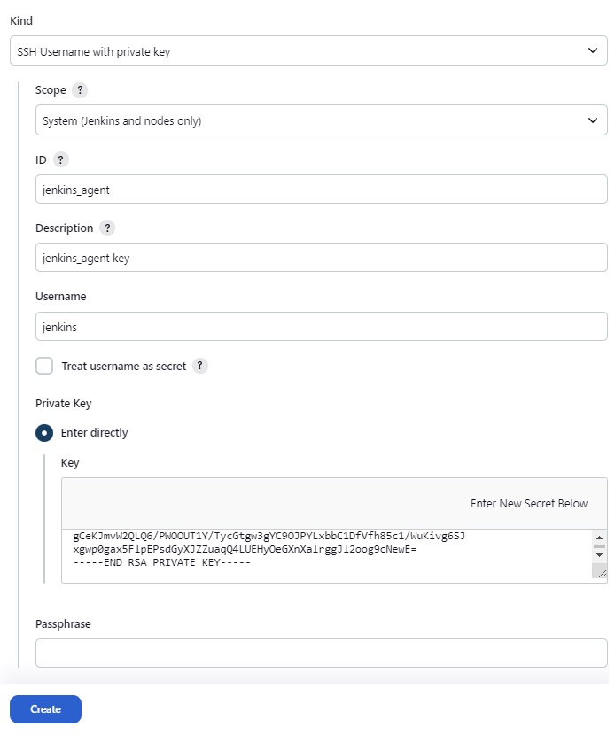
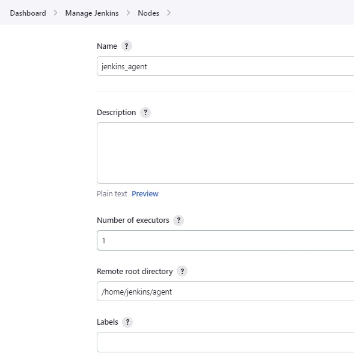

# Jenkins

## Create jenkins user

<details>
  <summary>Hide</summary>

- Create user `jenkins`

```bash
export USR=jenkins
ssh-keygen -q -N '' -m PEM -t rsa -f "$HOME/.ssh/id_rsa_$USR" <<< ""$'\n'"y" 2>&1 >/dev/null

# create new user
useradd -m -d /home/$USR -s /bin/bash $USR
usermod -aG docker $USR

mkdir -p /home/$USR/.ssh
touch /home/$USR/.ssh/authorized_keys

cat "$HOME/.ssh/id_rsa_$USR.pub" >> /home/$USR/.ssh/authorized_keys
ssh -i $HOME/.ssh/id_rsa_$USR $USR@localhost "docker --version && echo '>>> DONE. New user added'"
```

- Activate new user

```bash
su jenkins
```

- Run Jenkins and mount Docker services in host to jenkins container

```bash
id
docker volume create jenkins_volume
docker run -v /var/run/docker.sock:/var/run/docker.sock -v $(which docker):$(which docker) -v jenkins_volume:/var/jenkins_home -p 8081:8080 --user 1000:999 --name jenkins -d jenkins/jenkins:lts
```

where `1000`: is jenkins user-id, `999`: docker group-id.

</details>


## Install Jenkins using Docker Compose

1. [Install Docker Compose](https://docs.docker.com/compose/install/).
2. Create a `docker-compose.yml` file:

  <details>
    <summary>docker-compose-jenkins.yml</summary>

  ```bash
  version: '3'

  networks:
    jenkins:
      external: false

  volumes:
    jenkins_volume:
      driver: local

  services:
    jenkins:
      image: jenkins/jenkins:lts
      container_name: jenkins
      restart: unless-stopped
      user: root
      privileged: true
      networks:
        - jenkins
      ports:
        - 8002:8080
        - 50000:50000
      volumes:
        - /var/run/docker.sock:/var/run/docker.sock
        - /usr/bin/docker:/usr/bin/docker
        - jenkins_volume:/var/jenkins_home
      shm_size: '256m'
  ```
  </details>

## [Create/Add Users in Jenkins & Manage Permissions](https://www.guru99.com/create-users-manage-permissions.html)

### How to Create/Add a User in Jenkins

<details>
  <summary>Hide</summary>

1. Login to Jenkins Dashboard.

2. `Dashboard` > `Manage Jenkins` > `Users` > `Create User`.

3. Enter Jenkins add user details like password, name, email etc. Then click `Create User`.

</details>

### How to Install Role Strategy Plugin in Jenkins

<details>
  <summary>Hide</summary>

1. `Dashboard` > `Manage Jenkins` > `Manage Plugins`.

2. Search `Role-based Authorization Strategy` plugin.

3. `Dashboard` > `Manage Jenkins` > `Security` > `Authorization` > `Role-Based Strategy` > `Save`. 

</details>

### How to Manage Users and Roles in Jenkins

<details>
  <summary>Hide</summary>

1. `Dashboard` > `Manage Jenkins` > `Manage and Assign Roles` > `Manage Roles`.

2. Type `developer` under `Role to add`.

3. Now, select the Jenkins user permissions you want to assign to the `developer` role.

  

4. Click `Add`

5. Click `Save`

</details>

### How to Assign Roles in Jenkins

<details>
  <summary>Hide</summary>

1. `Dashboard` > `Manage Jenkins` > `Manage and Assign Roles` > `Assign Roles`.

2. Add the new role `developer` to new user.

3. Click `Save`

</details>

### How to Create Project Roles in Jenkins

<details>
  <summary>Hide</summary>

1. `Dashboard` > `Manage Jenkins` > `Manage and Assign Roles` > `Manage Roles`.

2. Enter a role as “tester”

3. Add a pattern to this by adding tester.*, so that any username starting with “tester” will be assigned the project role you specify.

  

4. Click `Add`

5. Select privileges

6. Click `Save`

</details>

## [Adding a Jenkins Agent With Docker Compose](https://www.cloudbees.com/blog/how-to-install-and-run-jenkins-with-docker-compose#adding-a-jenkins-agent-with-docker-compose)

### Jenkisn Agent

<details>
  <summary>Hide</summary>

1. What is `agent` in Jenkins

  - In Jenkins, an `agent` refers to a computing resource, either a physical machine or a virtual environment, that Jenkins uses to execute build and automation tasks. Agents in Jenkins play a crucial role in the distributed build architecture of Jenkins, allowing the distribution of workload across multiple machines.

  - Here are the primary functions and roles of agents in Jenkins:

    - Distributed Builds
    - Parallel Execution
    - Isolation and Resource Allocation
    - Support for Various Environments
    - Dynamic Provisioning

2. Generate SSH Key

```bash
ssh-keygen -t rsa -f jenkins_agent
```

3. Create new Credential with private ssh key

  - `Dashboard` > `Manage Jenkins` > `Credentials` > `System` > `Global credentials` > `+ Add Credentials`.

  - Select kind `SSH Username with private key`

  - Limit the scope to `System`. This means the key can’t be used for jobs.

  - Give the credential an ID.

  - Provide a description.

  - Enter jenkins for a username. Don’t use the username used to create the key.

  - Under Private Key, check Enter directly.

  - Paste the contents of jenkins_agent in the text box.

  - `Create` to save the credential.

  


4. Create a `docker-compose.yml` file:

  - Contents of `jenkins_agent.pub` will be used in `docker-compose-jenkins.yml` in `ENVIRONMENT` as `JENKINS_AGENT_SSH_PUBKEY`.

  <details>
    <summary>docker-compose-jenkins.yml</summary>

  ```bash
  version: '3'

  networks:
    jenkins:
      external: false

  volumes:
    jenkins_volume:
      driver: local

  services:
    jenkins:
      image: jenkins/jenkins:lts
      container_name: jenkins
      restart: unless-stopped
      user: root
      privileged: true
      networks:
        - jenkins
      ports:
        - 8002:8080
        - 50000:50000
      volumes:
        - /var/run/docker.sock:/var/run/docker.sock
        - /usr/bin/docker:/usr/bin/docker
        - jenkins_volume:/var/jenkins_home
      shm_size: '256m'

    agent:
      image: jenkins/ssh-agent:jdk11
      container_name: agent
      privileged: true
      user: root
      networks:
        - jenkins
      expose:
        - 22
      environment:
        - JENKINS_AGENT_SSH_PUBKEY=ssh-rsa AAAAB3NzaC1yc2EAAAADAQABAAABgQC9zGXweNUXxidRXAs3Ca6PyQiQMg/i5xAc1cK+beYd7CUf9jDAIFCrwgIepfJNtVt4ym29zMi4XvtsC9sS1yzS1yN1MPAsxdF2BSMiCb6zs8erpEfo0JgEMEiXXTE8e9q0hsYQWPdWeGWgeyc/Cum+6JOjlelLVwMZlnhrx2u8SBmHgTcYUKgnadMBJRWkd4mC63muSbv2sspVHHGdhFIupb7S59aFV3ozQzETyU2CELvCpL+5SfM/lUeO8Ls6UMbQ9ZZKNAD1O1ww9sFI9qZvMSx53hpHz3MSgYSwThWaatB6xV8iTB4yyZjrGZCkpPDLui3OrQ/xcDWVHWAOhU5K/5TthjSCeqt3wtPAW7QfVmxLPwxRznnWDZR7s50TlLMSWbXtHikeomGYuR7bDi4k+JCHuMmxUiIxNu6RDiQNybZFGBydZwvyo/iM4y4YJB+D79l1OuSOTJNISS7QYXys2vh4RRFxHHk9A4LTdCeq6LMOf7Z9OmSE6XHgmCetu4k= emoi@hello-emoi
  ```
  </details>

</details>

### Jenkins Node

<details>
  <summary>Hide</summary>

1. What is `Node`

  - In Jenkins, a `node` refers to a machine, either physical or virtual, that is part of the Jenkins environment and contributes resources to Jenkins for executing tasks, jobs, or builds. Nodes play a crucial role in Jenkins' distributed build architecture, allowing the distribution of workload across multiple machines.

  - Nodes can serve various purposes and perform different functions within Jenkins:

    - Agent for Running Jobs
    - Distributed Builds
    - Master and Slave Configuration
    - Dynamic Provisioning
    - Labels and Node Usage

2. Create new `node`

  - `Dashboard` > `Manage Jenkins` > `Nodes` > `+ New Node`.

  - Input node's name, then select node's type is `Permanent Agent`

  - Set the Remote root directory to `/home/jenkins/agent`.

  - Under `Launch method`, select `Launch agents via SSH`.

  - For `Host`, enter `agent`. Each container can reach the others by using their container names as hostnames.

  - Next, click the dropdown under `Credentials` and select the one you just defined.

  - Now, under `Host Key Verification Strategy`, select `Non verifying Verification Strategy`.

  - `Advanced` on the below.

  - Set the `JavaPath` to `/usr/local/openjdk-11/bin/java`.

  - Click `Create`.

  

</details>
