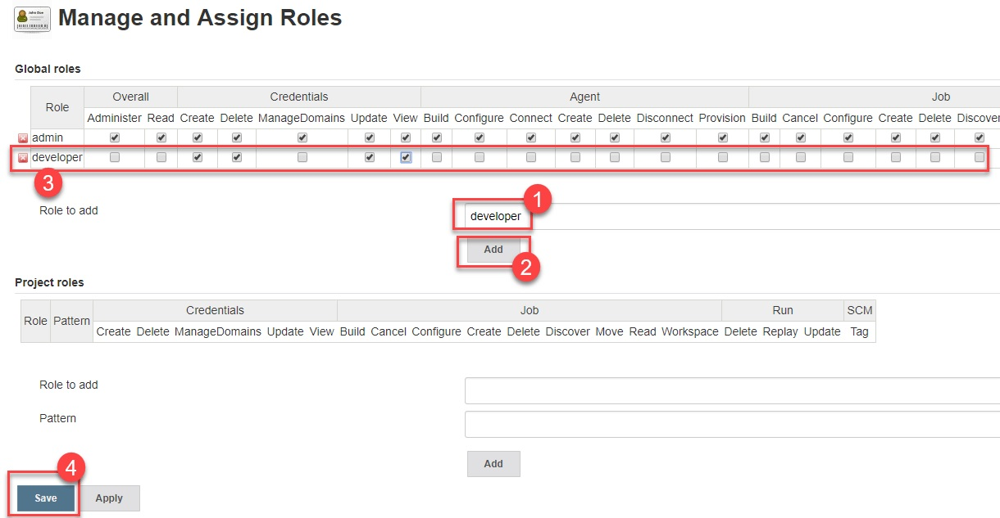
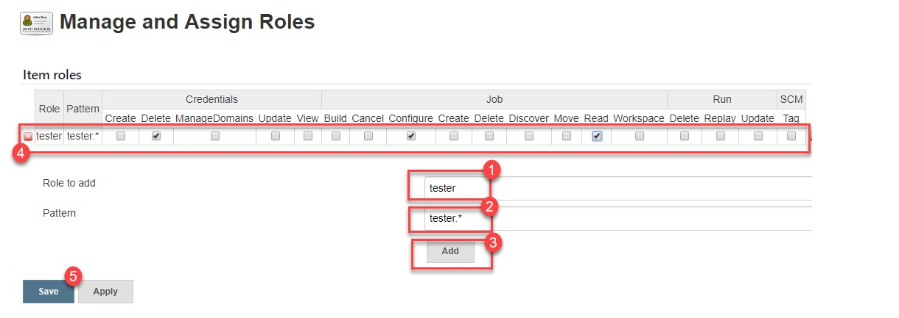

# Jenkins

## Create jenkins user

<details>
  <summary>Hide</summary>

- Create user `jenkins`

```bash
export USR=jenkins
ssh-keygen -q -N '' -m PEM -t rsa -f "$HOME/.ssh/id_rsa_$USR" <<< ""$'\n'"y" 2>&1 >/dev/null

# create new user
useradd -m -d /home/$USR -s /bin/bash $USR
usermod -aG docker $USR

mkdir -p /home/$USR/.ssh
touch /home/$USR/.ssh/authorized_keys

cat "$HOME/.ssh/id_rsa_$USR.pub" >> /home/$USR/.ssh/authorized_keys
ssh -i $HOME/.ssh/id_rsa_$USR $USR@localhost "docker --version && echo '>>> DONE. New user added'"
```

- Activate new user

```bash
su jenkins
```

- Run Jenkins and mount Docker services in host to jenkins container

```bash
id
docker volume create jenkins_volume
docker run -v /var/run/docker.sock:/var/run/docker.sock -v $(which docker):$(which docker) -v jenkins_volume:/var/jenkins_home -p 8081:8080 --user 1000:999 --name jenkins -d jenkins/jenkins:lts
```

where `1000`: is jenkins user-id, `999`: docker group-id.

</details>


## Install Jenkins using Docker Compose

1. [Install Docker Compose](https://docs.docker.com/compose/install/).
2. Create a `docker-compose.yml` file:

  <details>
    <summary>docker-compose-jenkins.yml</summary>

  ```bash
  version: '3'

  networks:
    jenkins:
      external: false

  volumes:
    jenkins_volume:
      driver: local

  services:
    jenkins:
      image: jenkins/jenkins:lts
      container_name: jenkins
      restart: unless-stopped
      user: root
      privileged: true
      networks:
        - jenkins
      ports:
        - 8002:8080
        - 50000:50000
      volumes:
        - /var/run/docker.sock:/var/run/docker.sock
        - /usr/bin/docker:/usr/bin/docker
        - jenkins_volume:/var/jenkins_home
      shm_size: '256m'
  ```
  </details>

## [Create/Add Users in Jenkins & Manage Permissions](https://www.guru99.com/create-users-manage-permissions.html)

### How to Create/Add a User in Jenkins

1. Login to Jenkins Dashboard.

2. `Dashboard` > `Manage Jenkins` > `Users` > `Create User`.

3. Enter Jenkins add user details like password, name, email etc. Then click `Create User`.

### How to Install Role Strategy Plugin in Jenkins

1. `Dashboard` > `Manage Jenkins` > `Manage Plugins`.

2. Search `Role-based Authorization Strategy` plugin.

3. `Dashboard` > `Manage Jenkins` > `Security` > `Authorization` > `Role-Based Strategy` > `Save`. 

### How to Manage Users and Roles in Jenkins

1. `Dashboard` > `Manage Jenkins` > `Manage and Assign Roles` > `Manage Roles`.

2. Type `developer` under `Role to add`.

3. Now, select the Jenkins user permissions you want to assign to the `developer` role.

  

4. Click `Add`

5. Click `Save`

### How to Assign Roles in Jenkins

1. `Dashboard` > `Manage Jenkins` > `Manage and Assign Roles` > `Assign Roles`.

2. Add the new role `developer` to new user.

3. Click `Save`

### How to Create Project Roles in Jenkins

1. `Dashboard` > `Manage Jenkins` > `Manage and Assign Roles` > `Manage Roles`.

2. Enter a role as “tester”

3. Add a pattern to this by adding tester.*, so that any username starting with “tester” will be assigned the project role you specify.

  

4. Click `Add`

5. Select privileges

6. Click `Save`


